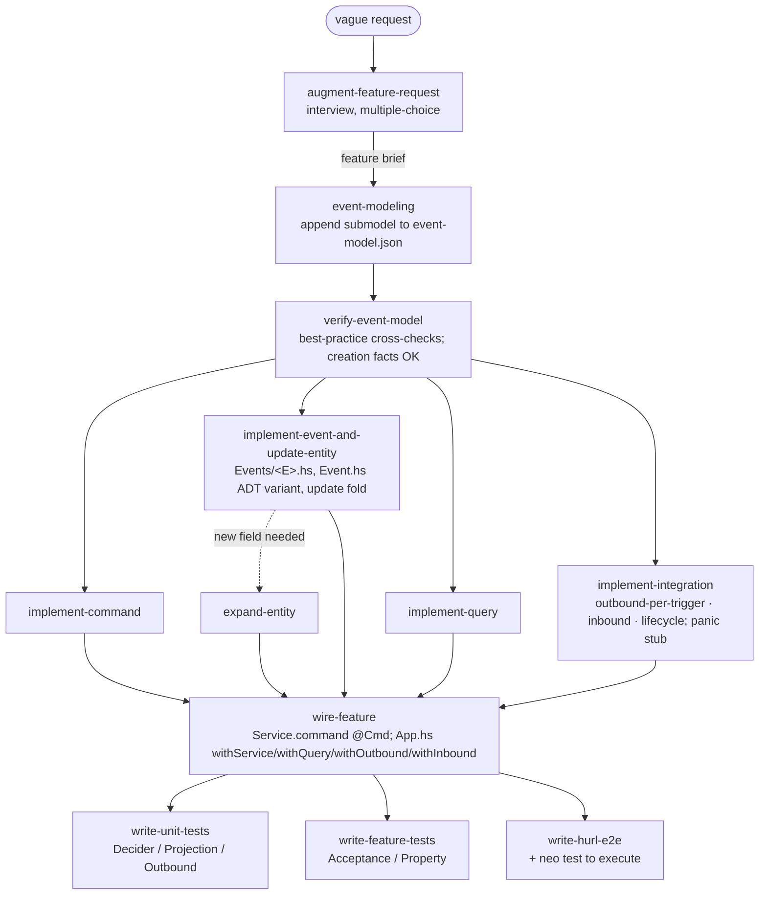

# NeoHaskell User Skills — Blueprint

Reference design for the **flat, independent skill set** in this repo. Skills live at
`skills/<name>/SKILL.md`; consumers install them with `neo skills setup`, which copies each
folder into the project's `.claude/skills/<name>/` (and equivalents for other tools).

Companion document: [`prompt.md`](./prompt.md) is the build directive that produces these
skills; this file is the exhaustive reference it points at.

> **Privacy rule (non-negotiable):** every example in the skills and in this document uses
> **only public NeoHaskell repositories** — the `neo` test-project `Counter` and the
> `testbed` `Cart`/`Stock`. No identifiers, paths, domains, third-party choices, or logic
> from any private client project may appear in any committed artifact.

---

## Table of contents

1. [What we're building and why](#1-what-were-building-and-why)
2. [NeoHaskell ground truth](#2-neohaskell-ground-truth)
3. [The feature pipeline](#3-the-feature-pipeline)
4. [`event-model.json` schema mapping](#4-event-modeljson-schema-mapping)
5. [Atomic skills inventory](#5-atomic-skills-inventory)
6. [`skills/` folder tree](#6-skills-folder-tree)
7. [`SKILL.md` conventions](#7-skillmd-conventions)
8. [Immutability and versioning automation](#8-immutability-and-versioning-automation)
9. [Decisions made and open assumptions](#9-decisions-made-and-open-assumptions)

---

## 1. What we're building and why

A set of **user-level** (not framework-maintainer) skills that let an AI agent add features to a
NeoHaskell project **incrementally**, while respecting NeoHaskell's core philosophy:

- **Deployed code is immutable.** Once a command/event/query file is "locked" (deployed), it is
  never edited, renamed, or deleted. Bug fixes and changes are made by **duplicating** the
  artifact with a `V2`/`V3` suffix. See [§8](#8-immutability-and-versioning-automation).
- **Entities (aggregates) may evolve, but only backward-compatibly** — add fields, never remove,
  rename, or retype. There is *no* automated check for this; it is convention enforced by the
  skills.
- **Constant greenfield.** Each new feature treats existing **entities** as the model to build on,
  but treats events/commands/queries/integrations as if they don't exist yet — you add new ones.

### Design decisions (set by the repo owner)

| Aspect | Decision |
| --- | --- |
| Architecture | **Flat, independent peer skills.** No central orchestrator. Each skill declares its **Inputs / Outputs / Next** so a human or a driving agent can chain them. |
| Target reader | **A very weak LLM** that defaults to hallucinating vanilla Haskell. Every skill must be self-contained, with copy-paste templates and explicit DO/DON'T tables. |
| Reference apps | Patterns may be *learned* from private apps but examples are **public-only** (Counter, Cart/Stock). |
| Auth API | The newer `Service.AccessControl` / `AccessError` API. |
| Stub convention | `panic "TODO: not implemented"` everywhere — loud fail-fast (NeoHaskell has **no** `todo`). |
| Outbound integrations | **One handler type per trigger** (e.g. `ReserveStockOnItemAdded`). |
| Tests | **Full pyramid** — Decider + Projection + Outbound + Acceptance + Property (Hspec/QuickCheck) plus hurl e2e. |
| `Core.hs` barrel | **Thin** — re-export `Entity` + `Event` only (add value-object/enum modules only when a context has them). |
| Model tiers | **Opus 4.8** for planning/verification (`augment-feature-request`, `event-modeling`, `verify-event-model`, `neohaskell-code-review`); **Sonnet** for implementers/test-writers/CI-config; **Haiku** for cheatsheet + tooling reference. See [§10](#10-build--review-process). |
| Integration scope | **Inbound (timer/webhook via `withInbound`/`Timer`) + stateful lifecycle outbound (`withOutboundLifecycle`) are in scope**, alongside outbound-per-trigger. |
| Command vs query auth | Auth is **off by default**; the `authenticatedAccess` default is enforced only when `Application.withAuth` wires JWT. A **query** must always declare `canAccess`+`canView` (`deriveQuery` won't compile otherwise). |
| Test suite | Full Haskell pyramid depends on the fix for [neohaskell/neo#2](https://github.com/neohaskell/neo/issues/2) (stock `neo` generates no `test-suite` stanza); hurl e2e runs today. |
| PR review | Two review skills: `neohaskell-code-review` (diff-scoped reviewer, Opus) + `neohaskell-code-review-ci` (provider-agnostic CI wiring, Sonnet). |

### The "weak LLM" doctrine (applies to every skill)

1. Open with a one-line **"This is NeoHaskell, not Haskell"** warning and the `.hs`-is-shared-extension trap.
2. Provide a **complete, copy-pasteable template** with a placeholder convention (`<Thing>`).
3. Provide a **DO / DON'T table** mapping the vanilla-Haskell reflex to the NeoHaskell-correct form.
4. State **Inputs / Outputs / Next skill(s)** at the top so the flat set is chainable.
5. End with a **"how to check it compiled"** step (`neo build`).

---

## 2. NeoHaskell ground truth

This is the condensed cheat that every skill must respect. The language cheatsheet skills
(§5) expand each subsection into a standalone skill.

### 2.1 The prelude is `Core`; `Prelude` is OFF

- Every module begins with `import Core` (plus qualified imports). `NoImplicitPrelude` is on
  project-wide, so the vanilla `Prelude` is **not** in scope.
- `default-language: GHC2021` with a large default-extension set: `OverloadedRecordDot`,
  `NoFieldSelectors`, `DuplicateRecordFields`, `OverloadedStrings`, `OverloadedLists`,
  `DataKinds`, `TypeFamilies`, `TemplateHaskell`, `Strict`, `BlockArguments`, `QuasiQuotes`,
  `ImportQualifiedPost`, … (consumers get these from the generated cabal file; do not re-declare).

### 2.2 The vanilla-Haskell trap table (the single most important artifact)

| You'll reflexively write (Haskell) | NeoHaskell-correct |
| --- | --- |
| `String` / `[Char]` | `Text` (string literals are already `Text`) |
| `[a]` list as the default sequence | `Array a` (qualified `Array.*`) |
| `map` / `filter` / `length` / `head` / `!!` (unqualified) | `Array.map` / `Array.takeIf` (keep) / `Array.dropIf` (drop) / `Array.length` / `Array.get :: Int -> Array a -> Maybe a` |
| `IO a` for effects | `Task err a` (`IO` only at `main`) |
| `pure x` / `return x` | `Task.yield x` (or `Result.Ok x`) |
| `Either a b` / `Left` / `Right` | `Result error value` / `Err` / `Ok` (error is the **first** type param) |
| custom `Optional`/`Some`/`None` | `Maybe` / `Just` / `Nothing` (+ `Maybe.withDefault`, `Maybe.map`, `Maybe.andThen`) |
| `f $ x` | `x \|> f` (pipe) or `f <\| x` |
| `f . g` | `f .> g` (forward) or `g <. f` (backward) |
| `<>` to concat | `++` (Appendable) — but for strings prefer `[fmt\|...#{expr}...\|]` |
| `/=` | `!=` |
| `()` type / value | `Unit` / `unit` |
| `error "x"` / `undefined` | `panic :: Text -> a` |
| `putStrLn` / `print` / `getLine` | `Console.print :: Text -> Task _ Unit`, `Console.log`, `Console.readLine` |
| `id` / `const` / `void` | `identity` / `always` / `discard` |
| `div` / `quot`; `/` on ints; `^`/`**` | `//` (int div); `/` is Float-only; `^` is Float-only; `Int.powerOf` for int powers |
| record field as getter `field rec` | dot access `rec.field` (NoFieldSelectors) or section `(.field)` |
| `let x = .. in body` / `where` | do-`let`: `do let x = ..; body` (style guide forbids `let..in`/`where`) |
| multiple function-head equation patterns | a single `case x of` |
| `<$>` / generic `fmap` | type-specific `Array.map` / `Task.map` / `Maybe.map` / `Result.map` |
| import `Data.Text`/`Data.Map`/`Data.Vector`/`Data.Aeson` directly | use `Text`/`Map`/`Array`/`Json`; if a base import is truly needed, qualify it `as GhcList` etc. |

### 2.3 Collections (`Array`, `Map`, `Text`, `Set`)

- **`Array a`** (Vector-backed) is the default sequence. Construct: `Array.empty`, `Array.wrap x`,
  `Array.range lo hi` (inclusive), `[1,2,3] :: Array Int` (OverloadedLists). Query: `Array.length`,
  `Array.get i` (→ `Maybe`), `Array.first`/`last` (→ `Maybe`), `Array.contains`, `Array.find`.
  Transform: `Array.map`, `Array.takeIf`/`dropIf` (**there is no `Array.filter`**), `Array.reduce`
  (fold from the **right**), `Array.foldl` (left). Mutate-by-copy: `Array.push` (appends to **end**),
  `Array.pushBack` (**prepends** — misnamed), `Array.set i`.
- **`Map`** (Elm-style over `Data.Map.Strict`): `Map.set` (not insert), `Map.get` (→ `Maybe`),
  `Map.getOrElse`, `Map.contains` (not member), `Map.remove` (not delete), `Map.keys`/`values`/
  `entries` (→ `Array`), `Map.mapValues` (no `Map.map`/`Map.filter`). **`Map.reduce` takes the
  accumulator first**, unlike `Array.reduce`.
- **`Text`** is `Data.Text`, **not** `[Char]`. `Text.split sep txt :: Array Text`,
  `Text.joinWith sep arr`, `Text.replace old new`. Interpolate with `[fmt|Hello #{name}!|]`
  (the `#{expr}` syntax — not `${}`/`%s`).
- **`Set`** is **not** re-exported by `Core` — needs `import Set (Set)` + `import Set qualified`.

### 2.4 Event-sourcing building blocks + macros

Five kinds of building block, each a plain `.hs` module using `import Core`. The macros are real
and required; do not invent others.

| Block | Required pieces | Closing macro |
| --- | --- | --- |
| **Entity** (aggregate) | record `deriving (Generic)` + empty `Json` instances; `initialState`; `instance Default`; `type instance NameOf E = "E"`; `type instance EventOf E = Ev`; `instance Entity E (initialStateImpl/updateImpl)`; the `update :: Ev -> E -> E` fold | — |
| **Event** | one payload module per event under `Events/<Name>.hs` (type literally named `Event`); the context `Event.hs` ADT wrapping those; `getEventEntityId`; `type instance EntityOf Ev = E`; `instance Event Ev` | — |
| **Command** | record + `instance Json.FromJSON`; `getEntityId :: Cmd -> Maybe Uuid`; `decide :: Cmd -> Maybe E -> RequestContext -> Decision Ev`; optional `canAccess`; `type instance EntityOf Cmd = E`; `type instance TransportsOf Cmd = '[WebTransport]` | `command ''Cmd` |
| **Query** (read model) | record + `Json` + `instance ToSchema`; `canAccess`/`canView`; hand-written `instance QueryOf E Q (queryId/combine)` returning `Update q \| NoOp \| Delete` | `deriveQuery ''Q [''E]` |
| **Integration** (outbound, per trigger) | nullary marker `data H = H deriving (Generic, Typeable, Show)`; `type instance EntityOf H = E`; `handleEvent :: E -> Ev -> Integration.Outbound` (pure) | `outboundIntegration ''H` |

Key contracts:

- **`decide` always takes three arguments** and must terminate in a `Decider` smart constructor:
  `Decider.reject "msg"`, `Decider.acceptNew [..]` (creation / `StreamCreation`),
  `Decider.acceptExisting [..]` (existing stream), `Decider.acceptAny`, `Decider.acceptAfter`.
  Generate ids inside the `do` with `newId <- Decider.generateUuid`. A `do` block ending in a bare
  value or `pure` throws at runtime.
- **Creation vs update** is encoded by `getEntityId` (`Nothing` = create) **and** the accept
  constructor (`acceptNew` vs `acceptExisting`).
- **Auth differs for commands vs queries.** A **command** with no `canAccess` defaults to
  `authenticatedAccess` (login required) — the `command` macro makes it optional and falls back to
  the `Command` typeclass default; going public is an explicit `canAccess = publicAccess`. A
  **query** has **no implicit default**: `deriveQuery` *requires* both `canAccess` and `canView` and
  fails compilation if either is missing — always write them (use `authenticatedAccess`/`ownerOnly`
  for the secure choice, `publicAccess`/`publicView` to open up).
- **Auth import (chosen API):** `import Service.AccessControl (AccessError, UserClaims, publicAccess, authenticatedAccess, publicView, ownerOnly)`; `canAccess :: Maybe UserClaims -> Maybe AccessError`. Note: the `decide` third argument **`RequestContext` comes from `Service.Auth`**, not `Service.AccessControl`.
- **Where the entity↔event instances live:** `type instance EventOf E`, `type instance EntityOf Ev`, `instance Entity E`, and `instance Event Ev` are all **co-located in `Entity.hs`** (as in the public `Counter` source); `Event.hs` holds only the ADT + `getEventEntityId`.
- **Integrations are wired by type** (`Application.withOutbound @H`); the actual HTTP/AI/IO lives in
  a separate `ToAction` instance, never inside `handleEvent`. Cross-aggregate commands are emitted
  with `Integration.outbound Command.Emit { command = SomeCmd {..} }`.

### 2.5 Per-bounded-context module layout (as corrected by the owner)

Event **payloads** each get their own module; the context `Event.hs` is **only the ADT** that wraps
them; the **entity** is its own module. Thin `Core.hs` barrel.

```
src/<App>/<Context>/
  Core.hs                  -- thin barrel: re-export Entity + Event only
  Entity.hs                -- aggregate record + initialState + update fold + instances
  Event.hs                 -- the CONTEXT EVENT ADT (sum type) wrapping per-event payloads + getEventEntityId
  Events/
    <EventName>.hs         -- ONE payload record per event, type literally named `Event`   [LOCKABLE]
  Commands/
    <CommandName>.hs       -- record + getEntityId + decide + `command ''Name`              [LOCKABLE]
  Queries/
    <QueryName>.hs         -- read model + deriveQuery + QueryOf                            [LOCKABLE]
  Integrations/
    <Handler>.hs           -- per-trigger outbound handler + `outboundIntegration ''Name`
  Service.hs               -- bundles the context's commands via Service.command @Cmd
```

> **Why this layout matters for immutability:** `neo lock` locks any file under a directory
> component named exactly `Commands`, `Events`, or `Queries`. `Entity.hs` and the singular
> `Event.hs` ADT are **not** in those directories, so the aggregate and the event union can evolve;
> the per-event payload files and the commands/queries are frozen once deployed. See [§8](#8-immutability-and-versioning-automation).

### 2.6 The `neo` CLI (Rust; runs the Haskell toolchain inside Nix)

| Command | What it does |
| --- | --- |
| `neo new [name] [--library]` | scaffold a project (writes `neo.json`, downloads the starter, git init + lock hook) |
| `neo build [--watch] [--skip-lock-check]` | **lock-gate**, reconcile, then `nix develop --command bash -c "cabal build all"` |
| `neo run [--watch]` | reconcile, then `cabal run all` (app serves on `http://localhost:8080`) |
| `neo test [--watch]` | `cabal test all`, then discover & run every `tests/**/*.hurl` against a booted app |
| `neo lock [query] / --all / install / check` | manage the `.locked-files` immutability manifest (see §8) |
| `neo inspect [domains\|commands\|events\|queries\|integrations\|wiring\|sync]` | print/sync the domain model; **`neo inspect sync` rewrites `event-model.json` from source** |
| `neo ide [--host IP --port N]` | in-browser event-modeling IDE on `http://127.0.0.1:2323` (≠ the app API) |
| `neo skills setup [--tool …] [--skill …] [--force] [--dry-run] [--refresh]` | clone `github.com/neohaskell/skills`, install `skills/<name>/` into `.claude/skills/<name>/` (claude), `.agents/skills/` (codex), `.kiro/skills/`, `.cursor/rules/<name>.mdc`, or an `AGENTS.md` block |

Notes for skills: build/run/test require **Nix + a flake**; they are not plain `cabal`. `neo test`
also requires git. `--watch` is rejected under `--ci`. There is **no OpenAPI subcommand** — see §2.8.

### 2.7 Immutability mechanism (summary; full rules in §8)

`.locked-files` is a **plain-text** manifest (one repo-relative path per line) at the project root.
A violation = any locked path that also appears in `git status --porcelain`. Enforced by (1) the
git **pre-commit hook** (`neo lock install` → `neo lock check`) and (2) a **pre-build gate** inside
`neo build`. It is **not** GHC/compile-time and **not** hash-based. Fix = create a new sibling
`FooV2.hs` (exact `V`+integer naming) and leave the original byte-identical.

### 2.8 Running the app, endpoints, OpenAPI

- App listens on `http://localhost:8080`. Commands: `POST /commands/<kebab-name>`. Queries:
  `GET /queries/<kebab-name>`. Health: `GET /health`, `GET /ready`.
- OpenAPI is served by the Web transport at **`GET /openapi.json`**, **`GET /openapi.yaml`**, and a
  Scalar HTML page at **`GET /docs`** — **not** `/swagger`. API title/version come from
  `Application.withApiInfo` (defaults to `"API"` / `"1.0.0"` if unset).
- Config is declared with the `defineConfig` TH DSL; env var names are explicit via
  `|> Config.envVar "NAME"`; secrets use `Redacted` + `|> Config.secret`. Loaded at `Application.run`
  from CLI args + env + `.env`.

---

## 3. The feature pipeline

The skills are flat and independent, but the **intended chaining** to add one feature is:



Because the set is flat, each skill restates its **Inputs / Outputs / Next** so the chain works
whether driven by a human or an agent. When fixing a deployed (locked) artifact, the chain starts at
the relevant implementer skill in **V2 mode** (see §8) instead of `event-modeling`.

---

## 4. `event-model.json` schema mapping

The authoritative schema is **JSON Schema draft 2020-12**, `$id`
`https://neohaskell.org/schemas/event-model.v1.json`, owned by the public `neo` repo
(`assets/ide/src/model/event-model.schema.json`, mirrored by `types.ts`, validated by Rust in
`src/ide/validate.rs`). The on-disk file is `event-model.json` at the workspace root, normally
regenerated from source via `neo inspect sync`. The `event-modeling` skill **edits this JSON
directly** (additively) to add a feature.

### 4.1 Root object

Required keys: `id`, `name`, `chapters`, `entities`, `nodes`, `edges`, `slices`, `layout`.
Optional: `submodels`. `additionalProperties: false` at the root and in **every** `$def` — you may
not add convenience keys (`description`, `color`, `notes`, positions on nodes, …).

```jsonc
{
  "id": "m1", "name": "MyModel",
  "chapters":  [{ "id": "c1", "name": "C", "order": 0, "submodelId": "sm1" }],
  "submodels": [{ "id": "sm1", "name": "Checkout", "order": 0 }],   // a FEATURE
  "entities":  [{ "id": "e1", "name": "Cart", "order": 0 }],
  "slices":    [{ "id": "s1", "name": "AddItem", "chapterId": "c1", "order": 0 }],
  "nodes":     [ /* see §4.2 */ ],
  "edges":     [ /* see §4.3 */ ],
  "layout":    { "nodePositions": { "n1": {"x":0,"y":0} }, "viewport": {"x":0,"y":0,"zoom":1} }
}
```

### 4.2 Nodes (`oneOf`, discriminated by `type`)

| `type` | Required keys | Maps to code |
| --- | --- | --- |
| `event` | `id, type, name, entityId, sliceId` (+ optional `fields`) | `Events/<Name>.hs` payload + variant in `Event.hs` ADT + `update` case |
| `command` | `id, type, name, entityId, sliceId` (+ optional `fields`) | `Commands/<Name>.hs` (`command` macro) |
| `query` | `id, type, name, sliceId` (**no `entityId`**) | `Queries/<Name>.hs` (`deriveQuery`) |
| `integration` | `id, type, name, kind ("inbound"\|"outbound"), sliceId` | `Integrations/<Handler>.hs` — `outbound` → `outboundIntegration` (per trigger); `inbound` → `withInbound`/`Integration.Timer` |
| `uiPlaceholder` | `id, type, name, sliceId` | (frontend; out of scope for these backend skills) |

> **Trap:** for `event`/`command` nodes the keys `entityId` and `sliceId` are **required even when
> null** — `"entityId": null` must be present. `additionalProperties:false` means you may **not**
> add `entityId` to a `query`/`integration`/`uiPlaceholder` node.

`Field`: `{ "name": string, "type": string }` only.

### 4.3 Edges (`oneOf`, discriminated by `type`) — source → target node types

| `type` | source → target |
| --- | --- |
| `commandProducesEvent` | command → event |
| `eventFeedsQuery` | event → query |
| `eventTriggersIntegration` | event → integration |
| `integrationTriggersCommand` | integration → command |
| `commandFromUI` | uiPlaceholder → command |
| `queryToUI` | query → uiPlaceholder |

Every edge requires `id, type, sourceId, targetId` (source/target are non-empty strings).

### 4.4 Grouping & how a feature is appended

Grouping chain: `node → sliceId → Slice → chapterId → Chapter → submodelId → Submodel`. **A feature
is a `Submodel`.** Appending a new feature (the `event-modeling` skill's job) means, additively:

1. push a `Submodel` (`{id, name, order}`);
2. push one or more `Chapter`s with `submodelId` pointing at it;
3. push `Slice`s with `chapterId`;
4. push `nodes` (commands/events/queries/integrations) with `sliceId` set;
5. push `edges` connecting them per the table above;
6. add `layout.nodePositions` entries (and optionally `layout.bySubmodel[<submodelId>]`).

### 4.5 Referential integrity (validated by `neo` after shape check)

- every `edge.sourceId`/`targetId` exists in `nodes`;
- `node.entityId` (when a string) exists in `entities`;
- `slice.chapterId` (when a string) exists in `chapters`;
- `chapter.submodelId` (when a string) exists in `submodels`;
- nulls are always allowed; duplicate ids are **not** flagged in v1 (don't rely on that).

### 4.6 The `verify-event-model` skill's best-practice checks

Beyond schema validity: events are **past-tense facts** (`ItemAdded`, not `AddItem`); the **CRUD-name
smell is scoped to `Update*`/`Delete*` and imperative-echo names** — **creation facts are allowed**
(`CounterCreated`, `CartCreated`, `*Opened`, `*Registered`), matching the public sources; commands
are **imperative** (`AddItem`); every event is produced by a command (`commandProducesEvent`); every
query is fed by ≥1 event; integrations connect via `eventTriggersIntegration` /
`integrationTriggersCommand`; names are unique and PascalCase; no orphan nodes.

---

## 5. Atomic skills inventory

21 flat skills in three families. Each skill's `SKILL.md` states **Inputs / Outputs / Next** so the
flat set chains without an orchestrator.

### 5.1 Language cheatsheets (the anti-hallucination layer)

| Skill | One-liner | Inputs → Outputs |
| --- | --- | --- |
| `neohaskell-core-prelude` | `import Core`, operators (`\|>`, `.>`, `++`, `!=`), `panic`, `Unit`, and the full vanilla-Haskell trap table | code intent → idiomatic prelude usage |
| `neohaskell-collections` | `Array` (no `filter`; `takeIf`/`dropIf`; `get`→Maybe), `Map` (set/get/contains), `Text` (split/joinWith/`[fmt]`), `Set` | data shape → correct collection calls |
| `neohaskell-effects-and-errors` | `Task err a` (`yield`/`throw`/`runOrPanic`), `Result`/`Ok`/`Err`, `Maybe`, do-`let`, `[fmt\|…#{x}…\|]` | effectful/fallible logic → Task/Result code |
| `neohaskell-records-and-json` | records with `NoFieldSelectors`/dot access, empty `Generic` `Json` instances, `instance ToSchema` | data type → record + JSON wiring |
| `neohaskell-module-layout` | per-context layout: `Events/<E>.hs` payloads, `Event.hs` ADT, `Entity.hs`, thin `Core.hs`, `Commands/`, `Queries/`, `Integrations/`, `Service.hs` | context name → folder/module skeleton |

### 5.2 Tooling

| Skill | One-liner | Inputs → Outputs |
| --- | --- | --- |
| `neo-cli` | every `neo` subcommand, the Nix wrapping, ports, and what is/isn't a real command | task → correct `neo …` invocation |
| `neo-immutability-and-versioning` | `.locked-files`, `neo lock`, the lock gate, the exact `V`-bump rule, entity additive evolution | a change request → lock-safe action (edit vs V2) |
| `neo-config-and-secrets` | `defineConfig` DSL, env vars, `Redacted` secrets, `.env`, factory wiring | config need → `Config.hs` field + wiring |
| `neo-run-and-inspect` | run the app, the `/commands` `/queries` `/openapi.json` `/docs` `/health` endpoints, `neo ide`, `neo inspect sync` | "run it / see the API" → commands + URLs |

### 5.3 Feature pipeline

| Skill | One-liner | Inputs → Outputs → Next |
| --- | --- | --- |
| `augment-feature-request` | turn a vague request into a concrete brief via multiple-choice interview questions | vague ask → feature brief → `event-modeling` |
| `event-modeling` | append a feature (submodel + chapters + slices + nodes + edges) to `event-model.json` per the §4 schema | brief → updated `event-model.json` → `verify-event-model` |
| `verify-event-model` | best-practice + schema + referential cross-checks (§4.6) | event model → pass/fail + fixes → implementers |
| `implement-command` | command record + `getEntityId` + `decide` + `command ''Cmd` | command node → `Commands/<C>.hs` → `write-unit-tests` |
| `implement-event-and-update-entity` | `Events/<E>.hs` payload + `Event.hs` ADT variant + `getEventEntityId` + `update` fold case | event node → event modules + entity update → tests |
| `expand-entity` | add a field to an entity backward-compatibly (record + `initialState` + `update` + JSON default) | new field → edited `Entity.hs` → tests |
| `implement-query` | read model + `deriveQuery` + hand-written `QueryOf` `combine` + access control | query node → `Queries/<Q>.hs` → tests |
| `implement-integration` | per-trigger outbound handler + `outboundIntegration ''H`, stubbed with `panic "TODO"` | integration node → `Integrations/<H>.hs` → `wire-feature` |
| `wire-feature` | register commands in `Service.hs`; add `withService`/`withQuery`/`withOutbound` to `App.hs` | new blocks → edited `Service.hs`/`App.hs` → tests |
| `write-unit-tests` | Decider (command), Projection (query), Outbound (integration) Hspec specs | a building block → `test/<Layer>/…Spec.hs` |
| `write-feature-tests` | Acceptance (in-domain flow) + Property (QuickCheck `update` replay) specs | a feature → `test/Acceptance/…`, `test/Property/…` |
| `write-hurl-e2e` | hurl files (`[Captures]`/`[Asserts]`/`[Options] retry`) + run via `neo test` | a feature → `tests/**/*.hurl` + run result |

### 5.4 Review (PR-time)

| Skill | Model | One-liner | Inputs → Outputs |
| --- | --- | --- | --- |
| `neohaskell-code-review` | Opus | diff-scoped PR reviewer running the six lenses + ES/CQRS/immutability/privacy checks, severity-ranked | a PR diff → `file:line` findings (blocker/major/minor/nit) + verdict |
| `neohaskell-code-review-ci` | Sonnet | provider-agnostic CI wiring (GitHub Actions / GitLab CI / Azure DevOps / Bitbucket) to run the reviewer on every PR/MR | CI provider → the pipeline config + setup notes |

See [`SPEC.md` §6](./SPEC.md#6-the-two-review-skills) for the full spec of both.

---

## 6. `skills/` folder tree

```
skills/
  # language cheatsheets
  neohaskell-core-prelude/SKILL.md
  neohaskell-collections/SKILL.md
  neohaskell-effects-and-errors/SKILL.md
  neohaskell-records-and-json/SKILL.md
  neohaskell-module-layout/SKILL.md
  # tooling
  neo-cli/SKILL.md
  neo-immutability-and-versioning/SKILL.md
  neo-config-and-secrets/SKILL.md
  neo-run-and-inspect/SKILL.md
  # pipeline
  augment-feature-request/SKILL.md
  event-modeling/
    SKILL.md
    references/event-model.schema.json      # vendored copy of the v1 schema for offline validation
  verify-event-model/SKILL.md
  implement-command/SKILL.md
  implement-event-and-update-entity/SKILL.md
  expand-entity/SKILL.md
  implement-query/SKILL.md
  implement-integration/SKILL.md
  wire-feature/SKILL.md
  write-unit-tests/SKILL.md
  write-feature-tests/SKILL.md
  write-hurl-e2e/SKILL.md
  # review (PR-time)
  neohaskell-code-review/SKILL.md
  neohaskell-code-review-ci/SKILL.md
```

Skills that ship a copy-paste template heavier than a short snippet keep it under
`references/` (e.g. `event-modeling/references/event-model.schema.json`).

---

## 7. `SKILL.md` conventions

- **Frontmatter** follows the agentskills.io spec read by `neo skills setup`: `name` and
  `description` are **required**, and the **folder name must equal the frontmatter `name`**.
  `description` is third-person and trigger-rich (when to use this skill).
- **Body** follows the weak-LLM doctrine (§1): warning → Inputs/Outputs/Next → copy-paste template
  → DO/DON'T table → "verify it compiled (`neo build`)".
- **Public examples only** (Counter, Cart/Stock). Never reference a private client domain, path, or
  service.

### Representative template (the `implement-command` skill ships this, Counter domain)

```haskell
module Starter.Counter.Commands.IncrementCounter (
  IncrementCounter (..),
  getEntityId,
  decide,
) where

import Core
import Decider qualified
import Json qualified
import Service.Auth (RequestContext)
import Service.Command.Core (TransportsOf)
import Service.CommandExecutor.TH (command)
import Service.Transport.Web (WebTransport)
import Starter.Counter.Core
import Starter.Counter.Events.CounterIncremented qualified as CounterIncremented


data IncrementCounter = IncrementCounter
  { entityId :: Uuid
  , amount :: Int
  }
  deriving (Generic, Typeable, Show)


instance Json.FromJSON IncrementCounter


-- | `Just` => load the existing entity before `decide`; `Nothing` => creation.
getEntityId :: IncrementCounter -> Maybe Uuid
getEntityId cmd = Just cmd.entityId


decide :: IncrementCounter -> Maybe CounterEntity -> RequestContext -> Decision CounterEvent
decide cmd entity _ctx = case entity of
  Nothing -> Decider.reject "Counter not found"
  Just existing ->
    if cmd.amount <= 0
      then Decider.reject "Amount must be positive"
      else
        Decider.acceptExisting
          [ CounterIncremented
              CounterIncremented.Event
                { entityId = existing.counterId
                , amount = cmd.amount
                }
          ]


type instance EntityOf IncrementCounter = CounterEntity


type instance TransportsOf IncrementCounter = '[WebTransport]


command ''IncrementCounter
```

The `event-and-update-entity`, `query`, `integration`, `wiring`, `config`, and `test` skills carry
the analogous public templates established in §2 and the Counter/Cart sources.

---

## 8. Immutability and versioning automation

This is the **hard-enforce + automate** behavior the owner chose. The `neo-immutability-and-versioning`
skill (and every implementer skill) must encode it.

### 8.1 What is locked

`neo lock` discovers "domain files" by walking `src/` and matching any path with a **directory
component named exactly** `Commands`, `Events`, or `Queries`. So:

- **Locked / immutable once deployed:** `src/**/Commands/*.hs`, `src/**/Events/*.hs`,
  `src/**/Queries/*.hs`.
- **Not locked / may evolve:** `Entity.hs`, the singular `Event.hs` ADT, `Core.hs`, `Service.hs`,
  `App.hs`, `Integrations/*.hs`, `Config.hs`.

A path is "violated" when it appears in **both** `.locked-files` and `git status --porcelain`. The
violation is caught by the `neo build` pre-build gate and the git pre-commit hook. (Not GHC, not
hashing.)

### 8.2 The skill's required behavior on a change to a deployed artifact

1. **Detect** whether the target is locked: is its path in `.locked-files`? (or, more simply, does it
   live under `Commands/`/`Events/`/`Queries/` and is the project already deployed?)
2. If locked: **refuse to edit/rename/delete it.** Leave it byte-identical.
3. **Scaffold a new sibling** with an exact `V`+integer suffix: `Foo.hs` → `FooV2.hs` (and the type
   `Foo` → `FooV2`); if `FooV2` exists, use `FooV3`, etc. **Wrong forms to reject:** `foo_v2`,
   `Foo.V2`, `FooVersion2`, `Foov2` (lowercase `v`), `Foo_V2`. Filename stem and type name must match.
   - For event payload files the in-file type is literally `Event`; version at the **module/file**
     level (`Events/ItemAddedV2.hs` still exports `Event`), and add a new variant
     `ItemAddedV2 ItemAddedV2.Event` to the `Event.hs` ADT.
4. **Wire the V2** in (new command into `Service.hs`, new query into `App.hs`, new event variant into
   the ADT + `update`), exactly as a fresh artifact.
5. Never advertise the escape hatches (`neo build --skip-lock-check`, hand-editing `.locked-files`);
   the railguard deliberately hides them.

### 8.3 Entity evolution (backward-compatible only)

Entities are **not** locked, but there is **no automated guard**. The `expand-entity` skill enforces
by convention: **add fields only**; never remove, rename, or change a field's type. A new field must
(1) be added to the record, (2) get a value in `initialState`, (3) be produced in the relevant
`update` case, and (4) decode for old snapshots (the entity's `Generic` `Json.FromJSON` must tolerate
its absence — give it a default). Removing/renaming/retyping would break replay of the event log and
old snapshots.

---

## 9. Decisions made and open assumptions

**Settled with the owner:** flat skills; weak-LLM doctrine; public examples only; newer
`Service.AccessControl`/`AccessError` auth; `panic "TODO: not implemented"` stubs; per-trigger
outbound integrations; full test pyramid + hurl; thin `Core.hs` barrel.

**Assumptions to confirm during build (flagged, not silently chosen):**

1. **HTTP port env var name** is author-chosen; the public Counter starter uses `PORT`. Skills will
   teach `Config.envVar "PORT"` unless told otherwise.
2. **`event-modeling` writes `event-model.json` directly.** `neo inspect sync` regenerates it *from
   source*, which would clobber a hand-authored model; the skill must therefore drive the design
   forward into code rather than expect round-tripping. Confirm this is the intended direction.
3. **Vendored schema copy.** The skill carries a copy of `event-model.v1.json` under `references/`
   for offline validation; it must be kept in sync with the `neo` repo's schema.
4. **A legacy auth API** (`Service.Query.Auth` / `QueryAuthError`) exists on older framework commits
   and is treated as out-of-date; the cheatsheets teach only the newer `Service.AccessControl` /
   `AccessError` API. Projects pinned to an older commit should bump before relying on the skills.

---

## 10. Build & review process

The skills are built (and, once shipped, exercised) through a **gated, cross-checked pipeline**
modeled on hierarchical review with human-in-the-loop gates. Full per-skill decomposition and the
critique-resolution log live in [`SPEC.md`](./SPEC.md).

### 10.1 Model-tier policy

Each skill runs its reasoning on a tier matched to its cognitive load. A skill declares `model:` in
frontmatter where honored and — per the `skill-audit` invocation-pattern convention — **delegates its
work to a sub-agent spawned with the matching `model:`** (`opus`/`sonnet`/`haiku`), so the tier holds
regardless of the consumer's session model.

| Tier | Model | Skills |
| --- | --- | --- |
| Planning / verification | **Opus 4.8** (`claude-opus-4-8`, max effort) | `augment-feature-request`, `event-modeling`, `verify-event-model`, `neohaskell-code-review` |
| Implement / test / CI-config | **Sonnet** (`claude-sonnet-4-6`) | the 9 implementer + test-writer skills, `neohaskell-code-review-ci` |
| Reference lookup | **Haiku** (`claude-haiku-4-5`) | the 5 `neohaskell-*` cheatsheets + 4 `neo-*` tooling skills |

### 10.2 The gated build pipeline

| Phase | Work | Cross-checks | Gate |
| --- | --- | --- | --- |
| 0 · Decompose | expand this blueprint into a per-skill spec (`SPEC.md`) | consistency + gap detection over all skills | ✅ owner reviews `SPEC.md` |
| 1 · Draft | one agent drafts each `SKILL.md` from its spec (parallel, on the skill's own tier) | — | — |
| 2 · Verify | — | the **six lenses** below, per skill; adversarial verification; majority-refute for disputed findings | ✅ owner reviews the verdict report |
| 3 · Integrate | dogfood a mock feature through the whole flat pipeline | end-to-end coverage + gap critic | ✅ owner sign-off before commit |

### 10.3 The six verify lenses

1. **template-compile-identifier** — every NeoHaskell identifier/import/macro resolves to real source (for JSON/hurl skills: schema-validity / real-endpoint resolution).
2. **neohaskell-language-correctness** — no vanilla-Haskell leakage; `import Core`; qualified calls; `#{}` fmt; `panic` stubs.
3. **es-event-modeling-correctness** — `decide` terminates in accept/reject; `update` fold totality; no CRUD event names (creation facts exempt); total `combine`; pure `handleEvent`; secure-by-default asymmetry.
4. **cross-skill-consistency** — Inputs/Outputs/Next chain; templates/terminology agree across skills and with this blueprint.
5. **frontmatter-best-practices** — `name` == folder; third-person trigger-rich `description`; weak-LLM doctrine; `model:` tier.
6. **privacy-adversarial** — zero client leakage + an adversarial pass trying to break each template.

### 10.4 Ongoing PR review

`neohaskell-code-review` (Opus) applies the same six lenses — plus immutability/V2 and secrets checks
— to a **PR diff**, emitting severity-ranked `file:line` findings; `neohaskell-code-review-ci`
(Sonnet) wires it to run on every PR/MR for the project's CI provider. This is the self-hosted,
no-third-party analogue of a CodeRabbit-style reviewer.
