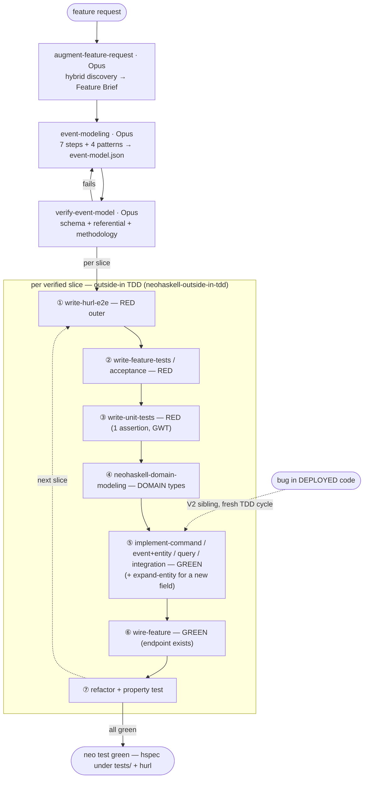

# NeoHaskell Skills

A set of **user-level** [Agent Skills](https://agentskills.io) that teach an AI agent how to build features in a **NeoHaskell** app — the event-sourced / CQRS framework and its custom `Core` prelude. They are designed for a *weak* model (the `.hs` extension is shared with Haskell, and models love to hallucinate vanilla Haskell), so every skill ships copy-paste templates grounded in real source plus explicit DO / DON'T tables.

Installed into a project with `neo skills setup` (→ `.claude/skills/`, `.agents/skills/`, `.cursor/rules/`, …). The skills are **flat and independent** — each is usable standalone and declares its own Inputs / Outputs / Next — with one **entry-point** skill that drives the whole flow.

## Quick start

```bash
neo skills setup            # installs these skills into your project
```

Then, in your agent: **"add a feature to my NeoHaskell app"** (or start a new project, or fix a deployed bug). That triggers **`neohaskell-feature-pipeline`**, the entry point, which sequences everything below.

## Philosophy

NeoHaskell treats software as **immutable, append-only** and develops **incrementally**:

- **Deployed code is frozen.** Once a file under `Commands/`, `Events/`, or `Queries/` is locked (deployed), it is never edited — a fix is a **`V2` sibling**. `neo build` refuses a changed locked file (via `.locked-files`).
- **Entities evolve add-only.** Aggregates aren't locked, but fields are only ever *added* (never removed, renamed, or retyped) so the event log still replays.
- **Constant greenfield.** Each feature builds on existing **entities** but treats events / commands / queries / integrations as new.
- **Outside-in TDD.** Design the events first, then build each slice **test-first** (jwilger-style): `RED → DOMAIN → GREEN → REFACTOR`.

## The pipeline

Design once, then build each vertical slice outside-in. Tests are written **first** (outside-in *order*), while the resulting test distribution stays **pyramid-shaped** (many fast unit/property tests, few slow e2e).



Reference **language** skills (`neohaskell-core-prelude`, `-collections`, `-effects-and-errors`, `-records-and-json`, `-module-layout`) and **tooling** skills (`neo-cli`, `neo-immutability-and-versioning`, `neo-config-and-secrets`, `neo-run-and-inspect`) are pulled in by any step as needed. **PR review** (`neohaskell-code-review` + `neohaskell-code-review-ci`) is a separate track.

## Skill catalog (26)

| Family | Skills | Tier |
| --- | --- | --- |
| **Entry point** | `neohaskell-feature-pipeline` | Opus |
| **Design** | `augment-feature-request`, `event-modeling`, `verify-event-model` | Opus |
| **Process / domain** | `neohaskell-outside-in-tdd` (Opus), `neohaskell-domain-modeling` (Sonnet) | Opus / Sonnet |
| **Implement (GREEN)** | `implement-command`, `implement-event-and-update-entity`, `expand-entity`, `implement-query`, `implement-integration`, `wire-feature` | Sonnet |
| **Test (RED-first)** | `write-hurl-e2e`, `write-feature-tests`, `write-unit-tests` | Sonnet |
| **Language cheatsheets** | `neohaskell-core-prelude`, `neohaskell-collections`, `neohaskell-effects-and-errors`, `neohaskell-records-and-json`, `neohaskell-module-layout` | Haiku |
| **Tooling** | `neo-cli`, `neo-immutability-and-versioning`, `neo-config-and-secrets`, `neo-run-and-inspect` | Haiku |
| **PR review** | `neohaskell-code-review` (Opus), `neohaskell-code-review-ci` (Sonnet) | Opus / Sonnet |

**Model tiers** match cognitive load: **Opus** for planning / verification / review, **Sonnet** for template-driven implementation and tests, **Haiku** for reference lookup. The tier lives in each skill's `metadata.model`; a Claude Code skill delegates its heavy step to a sub-agent on that model, and degrades to inline (advisory) in hosts without sub-agents.

## Conventions & edge cases

- **Tests live under `tests/`** — both Hspec/QuickCheck specs *and* `.hurl` files. `neo` discovers and compiles the Haskell specs there; **never** use a `test/` directory.
- **Stub convention** — pure functions and `Task` bodies use `panic "TODO: not implemented"`; an **outbound `handleEvent`** uses `Integration.none` + a `-- TODO:` comment (a `panic` in a pure handler crashes the dispatcher). There is **no** `todo` in NeoHaskell.
- **Auth** — commands are secure-by-default (`authenticatedAccess`) but only enforced when `Application.withAuth` wires JWT; queries **must** declare `canAccess` + `canView`. Uses `Service.AccessControl`; `RequestContext` comes from `Service.Auth`.
- **Event naming** — past-tense, specific business facts (`CopyBorrowed`, `MemberRegistered`). Creation facts (`*Created`) are fine; the smell is present-tense / RPC-echo (`ProcessPayment`) and vague (`CartUpdated`).
- **Integrations** — outbound (one handler per trigger), inbound (timers/webhooks via `withInbound` / `Timer`), and stateful lifecycle (`withOutboundLifecycle`).
- **Test suite** assumes [neohaskell/neo#2](https://github.com/neohaskell/neo/issues/2) (Haskell `test-suite` generation) is in place.
- **Examples** are public-only — the `Counter` starter, the `Cart`/`Stock` testbed, and a neutral illustrative `Library` domain (`BookTitle` / `Member` / `Loan`) for richer patterns.

## Methodology & attribution

The design skills adapt the **Event Modeling** methodology (Adam Dymitruk / [eventmodeling.org](https://eventmodeling.org), Martin Dilger's *Understanding Eventsourcing*) and the **outside-in TDD** discipline, both drawn from [jwilger/claude-code-plugins](https://github.com/jwilger/claude-code-plugins) (MIT) — **retargeted** to emit `event-model.json` and NeoHaskell code. The surrounding SDLC-plugin machinery (its red/green/domain sub-agents, task manager, personality) is **not** adopted.

## `AGENTS.md`

The repo ships a top-level [`AGENTS.md`](./AGENTS.md) — an always-on primer that `neo skills setup` injects into the consumer project's agent-instructions file (`CLAUDE.md` for Claude Code, `AGENTS.md` for others), inside a managed block. It gives an agent the baseline it needs *before* any specific skill triggers: this is NeoHaskell (not vanilla Haskell), start from `neohaskell-feature-pipeline`, and the non-negotiable invariants (immutability/V2, `tests/`, `import Core`).
