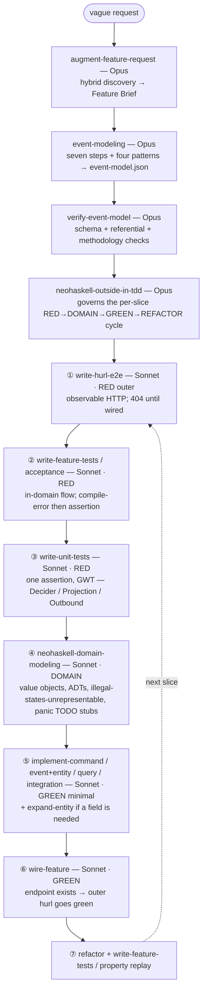

# NeoHaskell User Skills — Decomposition Spec (Phase 0)

Per-skill specification for the flat skill set, produced by the Phase-0 decomposition workflow and
its consistency/gap critic, with every critique finding resolved. This is the **manual-review gate**
before Phase 1 (drafting the `SKILL.md` files). Companion to [`BLUEPRINT.md`](./BLUEPRINT.md)
(ground truth) and [`prompt.md`](./prompt.md) (build directive).

> **Public examples only.** Every template is grounded in public NeoHaskell repos (the `neo`
> test-project `Counter`; the `testbed` `Cart`/`Stock`). Privacy sweep across all skeletons: **clean**.

## Table of contents
1. [Skill matrix](#1-skill-matrix)
2. [Model-tier policy](#2-model-tier-policy)
3. [Pipeline chaining](#3-pipeline-chaining)
4. [The six verify lenses](#4-the-six-verify-lenses)
5. [Per-skill specs](#5-per-skill-specs)
6. [The two review skills (#22, #23)](#6-the-two-review-skills)
7. [Critique resolutions](#7-critique-resolutions)
8. [To confirm during Phase 1](#8-to-confirm-during-phase-1)

---

## 1. Skill matrix

| # | Skill | Family | Model | Hands off to |
|---|---|---|---|---|
| 1 | `neohaskell-core-prelude` | cheatsheet | **Haiku** | collections, effects, records-json, module-layout |
| 2 | `neohaskell-collections` | cheatsheet | **Haiku** | effects, records-json, implement-event…, implement-query |
| 3 | `neohaskell-effects-and-errors` | cheatsheet | **Haiku** | core-prelude, collections, implement-command, implement-integration |
| 4 | `neohaskell-records-and-json` | cheatsheet | **Haiku** | implement-event…, expand-entity, implement-command, implement-query |
| 5 | `neohaskell-module-layout` | cheatsheet | **Haiku** | implement-event…, implement-command, implement-query, implement-integration, wire-feature |
| 6 | `neo-cli` | tooling | **Haiku** | neo-run-and-inspect, neo-immutability…, wire-feature, write-hurl-e2e |
| 7 | `neo-immutability-and-versioning` | tooling | **Haiku** | implement-command/event/query, expand-entity, wire-feature |
| 8 | `neo-config-and-secrets` | tooling | **Haiku** | implement-integration, wire-feature, neo-run-and-inspect |
| 9 | `neo-run-and-inspect` | tooling | **Haiku** | write-hurl-e2e, wire-feature, event-modeling |
| 10 | `augment-feature-request` | pipeline | **Opus** | event-modeling |
| 11 | `event-modeling` | pipeline | **Opus** | verify-event-model |
| 12 | `verify-event-model` | pipeline | **Opus** | neohaskell-outside-in-tdd, write-hurl-e2e |
| 13 | `implement-command` | pipeline | **Sonnet** | wire-feature (GREEN) |
| 14 | `implement-event-and-update-entity` | pipeline | **Sonnet** | expand-entity, wire-feature (GREEN) |
| 15 | `expand-entity` | pipeline | **Sonnet** | implement-event…, wire-feature |
| 16 | `implement-query` | pipeline | **Sonnet** | wire-feature (GREEN) |
| 17 | `implement-integration` | pipeline | **Sonnet** | wire-feature, implement-command |
| 18 | `wire-feature` | pipeline | **Sonnet** | refactor → next slice; write-feature-tests (property) |
| 19 | `write-unit-tests` | pipeline | **Sonnet** | neohaskell-domain-modeling → implement-* (RED→DOMAIN→GREEN) |
| 20 | `write-feature-tests` | pipeline | **Sonnet** | write-unit-tests (acceptance RED → inner loop) |
| 21 | `write-hurl-e2e` | pipeline | **Sonnet** | write-feature-tests (RED, outer loop) |
| 22 | `neohaskell-code-review` | review | **Opus** | (PR-time) neohaskell-code-review-ci |
| 23 | `neohaskell-code-review-ci` | review | **Sonnet** | (one-time CI setup) |
| 24 | `neohaskell-outside-in-tdd` | process | **Opus** | governs the per-slice cycle: hurl → feature → unit → domain-modeling → implement-* → wire |
| 25 | `neohaskell-domain-modeling` | pipeline | **Sonnet** | implement-command/event/query/integration (DOMAIN→GREEN) |

## 2. Model-tier policy

- **Opus 4.8** (`claude-opus-4-8`, max effort) — reasoning-heavy planning/verification/discipline: `augment-feature-request`, `event-modeling`, `verify-event-model`, `neohaskell-code-review`, `neohaskell-outside-in-tdd`.
- **Sonnet** (`claude-sonnet-4-6`) — template-driven implementers, test-writers, domain-modeling, and CI-config generation (incl. `neohaskell-domain-modeling`).
- **Haiku** (`claude-haiku-4-5`) — cheatsheet + tooling reference lookup.

**Mechanism.** Each skill declares its tier in frontmatter (`model:`) where honored, and — per the
`skill-audit` invocation-pattern convention — a skill step that delegates its work to a sub-agent
**spawns that Agent with the matching `model:`** (`opus`/`sonnet`/`haiku`). Planning skills therefore
run their reasoning on Opus regardless of the consumer's session model.

## 3. Pipeline chaining

Design comes first (`augment` → `event-modeling` → `verify`); then each vertical slice is built **outside-in, test-first** (jwilger's RED → DOMAIN → GREEN → DOMAIN → REFACTOR):

- **Outside-in inverts the WRITE ORDER, not the shape.** Start at the e2e/acceptance boundary and drive inward — but the resulting test **distribution stays pyramid-shaped** (many fast unit/property tests, few slow e2e). Avoid the ice-cream-cone (all hurl, no units).
- **Phase boundaries (jwilger).** RED touches only test files; DOMAIN only type definitions (`panic "TODO"` stubs); GREEN only implementation bodies. `neohaskell-code-review` flags violations.
- **Compiled-language RED.** In NeoHaskell, RED is often a **type error** ("let the compiler tell you what's missing"); GREEN = compiles + `neo build` passes; runnable hspec assertions come from the test-suite. **Assumes [neohaskell/neo#2](https://github.com/neohaskell/neo/issues/2) is in place** so the inner Haskell loop runs.
- **Cheatsheets (Haiku)** — `core-prelude` · `collections` · `effects-and-errors` · `records-and-json` · `module-layout` — and **tooling (Haiku)** — `neo-cli` · `neo-immutability-and-versioning` · `neo-config-and-secrets` · `neo-run-and-inspect` — are pulled in by any cycle skill as needed.
- **PR-time** (independent of the build cycle): `neohaskell-code-review` (Opus) is set up once by `neohaskell-code-review-ci` (Sonnet, provider-agnostic).
- **Deployed-fix path:** a locked-artifact change is a **fresh outside-in TDD cycle on the `V2` sibling** (`neo-immutability-and-versioning`), never an edit.

## 4. The six verify lenses

Applied per skill in Phase 2 (each spec lists which apply):

1. **template-compile-identifier** — every NeoHaskell identifier/import/macro in a template resolves to real framework source. (For JSON/hurl skills, reinterpreted as schema-validity / real-endpoint resolution.)
2. **neohaskell-language-correctness** — no vanilla-Haskell leakage (`String`/`[a]`/`IO`/`Either`/`$`/`.`/`<>`/`/=`/`pure`/`error`); `import Core`; qualified calls; `#{}` fmt; `panic` stubs.
3. **es-event-modeling-correctness** — `decide` terminates in accept/reject; creation-vs-update; `update` fold totality; no CRUD-named events (creation facts exempt); past-tense events; total `combine`; secure-by-default asymmetry; pure `handleEvent`.
4. **cross-skill-consistency** — Inputs/Outputs/Next chain; terminology/templates agree across skills and with BLUEPRINT.
5. **frontmatter-best-practices** — `name` == folder; third-person trigger-rich `description`; weak-LLM doctrine present; `model:` tier set.
6. **privacy-adversarial** — zero client leakage; plus an adversarial pass trying to make each template wrong/hallucinate vanilla Haskell.

---

## 5. Per-skill specs

Each block: **purpose** · **frontmatter description (condensed)** · **In → Out → Next** · **key DO/DON'T** · **acceptance** · **notes/fixes**. Full templates are grounded in the cited public sources and produced in Phase 1.

> **Outside-in TDD roles (per §24).** The blocks below describe each skill's *content*; their *order* is the outside-in cycle in §3. In that cycle the **test skills (19 `write-unit-tests`, 20 `write-feature-tests`, 21 `write-hurl-e2e`) are written RED-first** (before implementation), and the **implementers (13–17) run in the GREEN phase** — minimal code to pass the red test, then refactor — after the **DOMAIN phase (25 `neohaskell-domain-modeling`)** has created the types.

### 1 · `neohaskell-core-prelude` — Haiku
- **Purpose:** anti-hallucination base layer: `import Core` (Prelude OFF), operators (`|>` `<|` `.>` `<.` `++` `!=`), `panic`, `Unit`/`unit`, Int/Float math split, `[fmt|…#{x}…|]`, and the full trap table.
- **In:** a vanilla-Haskell reflex / module header / module under review. **Out:** `import Core` header + Core-idiomatic expressions + DO/DON'T map. **Next:** collections, effects, records-json, module-layout.
- **DO:** open with `import Core`, then `import X (X)` + `import X qualified`. **DON'T:** assume `Prelude`, or `$`/`.`/`<>`/`/=`/`()`/`error`/`pure`.
- **Acceptance:** identifiers resolve to Core/Basics; only Counter/toy domains; `neo build` compiles a scratch module.
- **Notes/fixes:** teach `#{expr}` and **warn REFERENCE.md's bare-`{name}` examples are wrong**; frame the `pure`/`return`/`fmap` DON'T as a **review rule** (they compile); only `Console.print` is a `Task` — `Console.log`/`readLine` return `IO` (need `Task.fromIO`); cross-link that `Set` is **not** re-exported by Core.

### 2 · `neohaskell-collections` — Haiku
- **Purpose:** `Array` (default sequence), `Map`, `Text`, `Set` — each vanilla reflex → correct qualified call.
- **In:** a sequence/lookup/string/set need or reflex. **Out:** correct `Array.*`/`Map.*`/`Text.*`/`Set.*` + imports + Maybe-safe access. **Next:** effects, records-json, implement-event…, implement-query.
- **DO:** filter with `Array.takeIf`/`dropIf`; index with `Array.get`→`Maybe`; `Map.set`/`get`/`contains`/`remove`; `import Set (Set)` + `import Set qualified`. **DON'T:** `Array.filter`, `arr !! i`, `head`, `Map.insert`/`lookup`/`member`, assume `Set` in scope.
- **Acceptance:** every identifier exported by its module; reduce arg-order trap (`Array.reduce` fn-first/right vs `Map.reduce` acc-first) stated.
- **Notes/fixes:** **add `Array.foldl`** (element-first left fold) — the replay-fold order used downstream; re-ground Counter refs on the real starter files (retract the "no Counter sources" open issue — they exist); `Array.pushBack` **prepends** (misnamed) — teach with a loud warning or omit.

### 3 · `neohaskell-effects-and-errors` — Haiku
- **Purpose:** `Task err value` (`yield`/`throw`/`andThen`/`runOrPanic`), `Result` (`Ok`/`Err`), `Maybe`, do-`let`, `[fmt|…#{}…|]`.
- **In:** effectful/fallible/optional logic or string-building. **Out:** idiomatic Task/Result/Maybe code + boundary reduction. **Next:** core-prelude, collections, implement-command, implement-integration.
- **DO:** `Task err value` (error first); `Task.yield`/`Task.throw`; `Result`/`Ok`/`Err`; do-`let`. **DON'T:** `IO a` for effects; `pure`/`return`/`error`; `Either`/`Left`/`Right`; `let…in`/`where`; `${}`/`%s`.
- **Acceptance:** no `IO` outside `main`; interpolation is `#{}`; every identifier resolves to Task/Result/Maybe/Basics.
- **Notes/fixes:** **add `import Text qualified`** to the skeleton (uses `Text.length`); run a `-Werror`-aware unused/missing-import audit; note IO↔Task bridge (`Task.fromIO`) for `Console.log`/`readLine`.

### 4 · `neohaskell-records-and-json` — Haiku
- **Purpose:** define a record + JSON (and `ToSchema` for read models) via **empty Generic** instances + `NoFieldSelectors` dot access.
- **In:** a set of fields + the record's role. **Out:** `data X = X {…} deriving (Generic)` + empty `Json.FromJSON`/`ToJSON` (+ `ToSchema` for queries) + dot access. **Next:** implement-event…, expand-entity, implement-command, implement-query.
- **DO:** dot access `rec.field`; empty `instance Json.FromJSON X`; `ToSchema` on **queries only**. **DON'T:** field-as-selector `field rec`; `deriving (FromJSON)`/`deriveJSON`; `import Data.Aeson`.
- **Acceptance:** NeoHaskell field types; no anyclass/TH JSON; dot access only.
- **Notes/fixes:** **fix the `StockLevel` source path** (point at `testbed/src/…/StockLevel.hs`, not the `dist-newstyle` build cache); cross-link the **backward-compat trap** (empty Generic `FromJSON` rejects an old snapshot missing a new non-`Maybe` field → belongs to `expand-entity`); settle `instance Default` ownership (here → default it in `neohaskell-module-layout`).

### 5 · `neohaskell-module-layout` — Haiku
- **Purpose:** per-context file/module layout (`Core.hs` thin barrel · `Entity.hs` · `Event.hs` ADT · `Events/<E>.hs` payloads · `Commands/` · `Queries/` · `Integrations/` · `Service.hs`) and lock-safe placement.
- **In:** context name + block list. **Out:** folder/module skeleton with GHC-correct names + lock-status placement map. **Next:** all implementers + wire-feature.
- **DO:** payload type is literally `Event` in `Events/<Name>.hs`; `Core.hs` re-export-only; keep `Entity.hs`/`Event.hs` out of `Commands`/`Events`/`Queries` dirs. **DON'T:** one fat module; `Event/` (singular dir); flat module names.
- **Acceptance:** module names mirror paths; `Core.hs` has no `import Core`/declarations; lockable dirs identified.
- **Notes/fixes:** own the **`instance Default` rule** (entities get `def = initialState`); **mark testbed `Cart` `Core.hs` as LEGACY fat-barrel** (teach the Counter split layout); place `EntityOf`/`instance Event` in `Entity.hs` (matches source; **correct BLUEPRINT §2.4**).

### 6 · `neo-cli` — Haiku
- **Purpose:** map a build/run/test/scaffold/lock/inspect/IDE/skills intent to the right `neo` subcommand; Nix-wrapped toolchain; ports/gates/prereqs.
- **In:** a tooling intent + project root. **Out:** exact `neo  [flags]` + what it wraps/requires. **Next:** neo-run-and-inspect, neo-immutability…, wire-feature, write-hurl-e2e.
- **DO:** `neo build`/`run`/`test` (Nix-wrapped `cabal … all`); real subcommands only; global flags before the subcommand. **DON'T:** `cabal`/`stack`/`ghc` directly; invent `neo serve`/`deploy`/`openapi`; `--watch` with `--ci`.
- **Acceptance:** every subcommand/flag matches `src/cli.rs`; ports attributed correctly.
- **Notes/fixes:** **single-owner split** — this skill owns the command surface + Nix wrapping + ports; defer `.locked-files` mechanics to `neo-immutability…` and endpoints to `neo-run-and-inspect` (prevents fact drift). App port `8080` comes from Config, not the CLI; note `neo test`'s 2s boot wait (not a `/ready` poll).

### 7 · `neo-immutability-and-versioning` — Haiku
- **Purpose:** `.locked-files` + `neo build` gate + git pre-commit hook; the exact `V`-bump rule for a locked `Commands`/`Events`/`Queries` artifact; add-only entity evolution.
- **In:** a change to (or lock violation on) a locked file. **Out:** edit-vs-V2 decision + a byte-preserving `V`+integer sibling + wiring. **Next:** implementers, expand-entity, wire-feature.
- **DO:** create `FooV2.hs` (type `FooV2`), leave the original byte-identical, wire the V2 in. **DON'T:** edit/rename/delete a locked file; `foo_v2`/`Foo.V2`/lowercase `v`; advertise `--skip-lock-check`.
- **Acceptance:** matches `lock.rs`/`errors.rs`; add-only entity rule stated.
- **Notes/fixes:** **do not teach `neo lock --remove`** (it doesn't exist — only `install`/`check`).

### 8 · `neo-config-and-secrets` — Haiku
- **Purpose:** `defineConfig` TH DSL (fields/defaults/env-vars/CLI flags) + `Config.secret` + `Redacted` + `.env`/`.env.example` + wiring/reading.
- **In:** a new tunable/secret. **Out:** a `Config.hs` `defineConfig` field + `Application.withConfig` wiring + `Config.get`/dot read. **Next:** implement-integration, wire-feature, neo-run-and-inspect.
- **DO:** `Config.field @T "name" |> Config.doc … |> Config.envVar "NAME"`; secrets `@(Redacted Text) |> Config.secret`. **DON'T:** hand-roll `getArgs`/`lookupEnv`; `String` fields; log a secret in plaintext.
- **Acceptance:** compiles under the DSL; secrets redacted.
- **Notes/fixes:** **use a neutral toy secret name (`apiToken`)** — never a real/branded third-party service identifier; **`{-# LANGUAGE TemplateHaskell #-}` is a project default extension** — present in source, **not** "required or it won't compile."

### 9 · `neo-run-and-inspect` — Haiku
- **Purpose:** run the app + its HTTP surface (`POST /commands/<kebab>`, `GET /queries/<kebab>`, `/openapi.json`, `/openapi.yaml`, `/docs`, `/health`, `/ready`); `neo ide` (:2323); `neo inspect [sync]`.
- **In:** "run it / hit the API / see the docs / open the IDE / sync the model". **Out:** the commands + URLs. **Next:** write-hurl-e2e, wire-feature, neo-cli, event-modeling.
- **DO:** `neo run`; OpenAPI at `/openapi.json` + Scalar at `/docs`. **DON'T:** bare `cabal run`; invent `neo openapi`/`serve`; `/swagger`; confuse `:2323` (IDE) with `:8080` (API).
- **Acceptance:** endpoints/ports match `Web.hs`; `neo inspect sync` clobber warning consistent.
- **Notes/fixes:** **`/ready` is 404 unless `Application.withReadinessProbe` is wired** — say so.

### 10 · `augment-feature-request` — **Opus**
- **Purpose:** turn a vague request into a concrete **Feature Brief** via Event Modeling facilitation (the "and then what happens?" probing). **Hybrid discovery:** on a **new project** (empty/absent `event-model.json`, no domain overview) run the full Phase-1 domain discovery once and write a domain overview; on later features, **feature-scoped** discovery onto the existing entities.
- **In:** a vague feature ask (+ whether a domain overview already exists). **Out:** a Feature Brief for `event-modeling` (plus, first run, a domain overview). **Next:** event-modeling.
- **Interview covers:** which existing entity it extends · the past-tense business fact (event) · the imperative command · read-model/query · outbound **and inbound** (timer/webhook) triggers · actors/who may run it · reject + edge-case rules (probe "what if it fails / is cancelled?").
- **DO:** ask 2-4 option questions; keep business language; name events past-tense/specific, commands imperative. **DON'T:** write Haskell, run `neo`, make architecture/tech decisions, emit present-tense/RPC verbs.
- **Acceptance:** brief is event-modeling-ready; terminal check is downstream build (no code here).
- **Notes/fixes:** grounded in `references/event-modeling-methodology.md`; **inbound-trigger question added** (enables the Translation pattern); hybrid discovery detects an existing overview.

### 11 · `event-modeling` — **Opus**
- **Purpose:** run the **seven-step** workflow design (User Goal → Brainstorm Events → Order chronologically → Identify Commands → Design Read Models → Find Automations → Map External Integrations) and append the result — `Submodel` → `Chapter`(s) → `Slice`(s) → command/event/query/integration nodes → edges → `layout` — to `event-model.json`, additively, schema-compliant. Grounded in `references/event-modeling-methodology.md`.
- **In:** a Feature Brief. **Out:** an updated `event-model.json` (existing content byte-preserved). **Next:** verify-event-model.
- **Four patterns → schema (the vocabulary it emits):** **State Change** = command→event (`commandProducesEvent`); **State View** = event→query (`eventFeedsQuery`); **Automation** = event→integration→command (`eventTriggersIntegration` + `integrationTriggersCommand`; the conditional lives in the handler/`decide`); **Translation** = inbound integration→command (`kind:"inbound"`). Full mapping at the [end of §5](#event-modeling-methodology--event-modeljson--neohaskell).
- **DO:** additive append; one vertical slice per user-meaningful step; required-even-when-null `entityId`/`sliceId` on event/command nodes; `integration.kind ∈ {inbound,outbound}`. **DON'T:** add keys (`additionalProperties:false`); reorder/rewrite existing nodes; model infrastructure (persistence/transport) as nodes; `neo inspect sync` after (clobbers from source).
- **Acceptance:** validates against the **vendored** `references/event-model.schema.json` + referential checks.
- **Notes/fixes:** **vendor the schema AND the methodology** into `references/`; **"create `event-model.json` if absent"** path; node names must equal the identifiers the implement-* skills will emit.

### 12 · `verify-event-model` — **Opus**
- **Purpose:** gate a freshly-appended feature: (1) JSON-Schema shape, (2) referential integrity (mirrors `validate.rs` + a duplicate-id check), (3) best practices neo never machine-checks.
- **In:** the updated `event-model.json`. **Out:** go/no-go verdict + concrete fixes. **Next:** the implement-* skills (or back to event-modeling).
- **Best-practice checks (from the methodology):** events are **past-tense, specific business facts** (`OrderPlaced`, `ItemRemovedFromCart`) — reject **present-tense / RPC-echo** (`ProcessPayment`, `CreateOrderDTO`) and **vague** names (`CartUpdated`, `DataUpdated`); imperative commands; every event produced by a command; every query fed by ≥1 event; **information completeness** (every read-model field traces to an event); **no `ReadModel→Command` flow** (structurally impossible in the schema — assert it holds); **no infrastructure read models / no infra modeled as Translation**; **true vs fake automation** (a real automation is conditional; unconditional co-production is a single State-Change slice); unique PascalCase names; no orphans.
- **DO:** run PASS 1 offline against the vendored schema; PASS 2/3 by inspection. **DON'T:** flag creation facts (`*Created`/`*Registered`/`*Opened` are good).
- **Notes/fixes:** naming rule follows the methodology (past-tense **specific fact** vs present/vague), not a blanket "no CRUD"; **inbound integrations in scope** (validate `kind:"inbound"`); **allow `uiPlaceholder`/`commandFromUI`/`queryToUI`**; no `neo validate` CLI — PASS 1 offline.

### 13 · `implement-command` — Sonnet
- **Purpose:** a `Commands/<Name>.hs` — record + `getEntityId` + three-arg `decide` + `EntityOf`/`TransportsOf` instances + `command ''Cmd`.
- **In:** a verified command node. **Out:** the command module. **Next:** write-unit-tests, implement-event…, wire-feature.
- **DO:** `decide cmd (Maybe entity) ctx` ending in `Decider.reject`/`acceptNew`/`acceptExisting`; ids via `Decider.generateUuid`; `getEntityId = Nothing` (create) / `Just cmd.id` (update). **DON'T:** `IO`/`pure`; return events directly; `RequestContext` from `Service.AccessControl`.
- **Acceptance:** `command` macro resolves; `neo build` compiles.
- **Notes/fixes:** **`RequestContext` is from `Service.Auth`** (only `UserClaims`/`AccessError`/`canAccess`/`publicAccess`/`ownerOnly` come from `Service.AccessControl`); **auth is enforced only when `withAuth` is wired** — teach the secure-default policy but note the default unauthenticated happy-path returns 200 (reconciles with `write-hurl-e2e`); teach the secure default only (no public command `canAccess` in public source).

### 14 · `implement-event-and-update-entity` — Sonnet
- **Purpose:** a new `Events/<Name>.hs` payload (type `Event`) + a variant in `Event.hs` ADT + `getEventEntityId` branch + a case in the entity's `update` fold.
- **In:** a verified event node. **Out:** the event modules + entity `update` case. **Next:** expand-entity (if a new field is needed), implement-command, write-unit-tests, write-feature-tests.
- **DO:** in-file type literally `Event`; wrap as `<Name> <Name>.Event`; exhaustive `case event of` in `update`. **DON'T:** name the payload after the file; edit a **locked** payload (→ V2); non-exhaustive `update`.
- **Acceptance:** `getEventEntityId` + `update` total; `neo build` compiles.
- **Notes/fixes:** creation facts (`*Created`) are allowed (aligns with `verify-event-model`); **state the command↔event ordering** (create the event payload + ADT variant before/with the emitting command).

### 15 · `expand-entity` — Sonnet
- **Purpose:** add a field to an entity **backward-compatibly** — record + `initialState` + relevant `update` cases + JSON decode for old snapshots. Add-only.
- **In:** a new field need. **Out:** edited `Entity.hs` that still loads old snapshots/replay. **Next:** implement-event…, write-feature-tests, write-unit-tests.
- **DO:** add-only; make the new field `Maybe` **or** hand-write `Json.(.:?)`/`.!=` with a default. **DON'T:** remove/rename/retype a field; add a required non-`Maybe` field with an empty Generic `FromJSON` (breaks old snapshots).
- **Acceptance:** old snapshot + replayed log still decode; `neo build` compiles.
- **Notes/fixes:** entities are **not** locked and get **no V2** (only add-only) — contrast with `neo-immutability…`.

### 16 · `implement-query` — Sonnet
- **Purpose:** a `Queries/<Name>.hs` read model — record + `Json`/`ToSchema` + `canAccess`/`canView` + `deriveQuery ''Q [''E]` + a hand-written `QueryOf` whose `combine` returns `Update`/`Delete`/`NoOp`.
- **In:** a verified query node. **Out:** the query module. **Next:** wire-feature, write-unit-tests.
- **DO:** write **both** `canAccess` and `canView` (required — `deriveQuery` won't compile without them); total `combine`. **DON'T:** `Data.Aeson`/Servant/SQL; omit auth (compile error).
- **Acceptance:** `deriveQuery` + `QueryOf` resolve; `neo build` compiles.
- **Notes/fixes:** multi-entity queries (one `instance QueryOf E Q` per entity) are **haddock-grounded only** — mark as advanced.

### 17 · `implement-integration` — Sonnet
- **Purpose:** integration handlers for a context. **Outbound-per-trigger:** nullary marker + `EntityOf` + pure `handleEvent :: E -> Ev -> Integration.Outbound` + `outboundIntegration ''H`. **Inbound:** `withInbound`/`Integration.Timer` (timer/webhook) source. **Lifecycle:** stateful `withOutboundLifecycle`.
- **In:** a verified integration node (`kind` inbound/outbound; stateful?). **Out:** the `Integrations/<H>.hs` module(s). **Next:** wire-feature, implement-command (if the emitted command is new), write-unit-tests.
- **DO:** one handler **per trigger**; emit cross-aggregate commands via `Integration.outbound Command.Emit {…}`; stub with `panic "TODO: not implemented"`. **DON'T:** `Task`/`IO`/HTTP inside `handleEvent`; hand-write the `OutboundIntegration` class; invent `todo`.
- **Acceptance:** `outboundIntegration`/inbound macros resolve; `neo build` compiles.
- **Notes/fixes:** **scoped in: inbound + lifecycle** (owner decision); teach the **new** thin-barrel import path (`<Context>.Core` re-exporting Entity+Event), noting the source was verified against the testbed's legacy combined `Core.hs`.

### 18 · `wire-feature` — Sonnet
- **Purpose:** register blocks — append `Service.command @Cmd` to `Service.hs`; add `withService`/`withQuery`/`withOutbound`/**`withInbound`** to `App.hs`.
- **In:** the implemented modules. **Out:** edited `Service.hs`/`App.hs`. **Next:** write-unit-tests, write-feature-tests, write-hurl-e2e.
- **DO:** `Service.new |> Service.command @Cmd`; `Application… |> withService … |> withQuery @Q |> withOutbound @H |> withInbound @() (…)`. **DON'T:** read `Config` at wiring time (use factory lambdas); forget the instance-only `import …Core ()`.
- **Acceptance:** endpoints reachable; `neo build` compiles, `neo inspect wiring` lists them.
- **Notes/fixes:** create the aggregating `Service` barrel only for multi-context apps (single-context imports the context service directly).

### 19 · `write-unit-tests` — Sonnet
- **Purpose:** Hspec unit specs for the three pure blocks — **Decider** (command `decide`), **Projection** (query `combine`), **Outbound** (integration `handleEvent`) — via the `Test` testlib + `Decider.runDecision`.
- **In:** a building block. **Out:** `test/{Decider,Projection,Outbound}/…Spec.hs`. **Next:** write-feature-tests, write-hurl-e2e.
- **DO:** `import Test`; `spec :: Spec Unit`; `it "…" \_ctx -> do`; `actual |> shouldBe expected`; `Decider.runDecision (DecisionContext {genUuid = Uuid.generate}) (decide cmd Nothing Auth.emptyContext)`. **DON'T:** `import Test.Hspec` (normal specs); `IO ()`; `shouldBe actual expected` (arg order).
- **Acceptance:** specs compile + pass once the test-suite exists.
- **Notes/fixes:** **assumes [neohaskell/neo#2](https://github.com/neohaskell/neo/issues/2)** (nearly landed) so `neo test` compiles/runs the generated `test-suite`; RED-first (before `implement-*`); share the exact clean reject string with `implement-command` (strip the `StubPackage` artifact).

### 20 · `write-feature-tests` — Sonnet
- **Purpose:** **Acceptance** spec (pure in-domain flow `decide → update → combine`, no HTTP) + **Property** spec (QuickCheck replay of the entity `update` fold via `Array.foldl update`).
- **In:** a completed feature. **Out:** `test/Acceptance/<Feature>Spec.hs`, `test/Property/<Entity>ReplaySpec.hs`. **Next:** write-hurl-e2e.
- **DO:** Acceptance via the `Test` wrapper; Property via `import Test.Hspec qualified as Hspec` + `Test.QuickCheck` + `GhcPrelude`-qualified list/bool ops. **DON'T:** boot the app (that's hurl); vanilla Hspec/QuickCheck idioms.
- **Acceptance:** compile + pass once the suite exists; generated quantities non-negative (`makeNaturalOrPanic`).
- **Notes/fixes:** same **neo#2** assumption (treated as available); acceptance spec is RED-first (outer loop, ② in §3); `Array.foldl update` (element-first left fold, oldest event first).

### 21 · `write-hurl-e2e` — Sonnet
- **Purpose:** `.hurl` e2e under `tests/` — `POST /commands/<kebab>`, `GET /queries/<kebab>` on `:8080` with `[Captures]`/`[Asserts]`/retrying `[Options]`; run via `neo test`.
- **In:** a completed feature. **Out:** `tests/**/*.hurl` + a run result. **Next:** neo-run-and-inspect.
- **DO:** capture `entityId`, reuse it, `[Options] retry` for eventually-consistent queries; assert `400`/`Rejected` for reject paths. **DON'T:** emit `.hs`; assume auth (default happy-path is unauthenticated → 200).
- **Acceptance:** `neo test` boots the app and the hurl files pass.
- **Notes/fixes:** **query response shape varies** — bare array (`$[?…]`) vs `{items:[…]}` (`$.items[?…]`); teach both, detect from the query.

### 24 · `neohaskell-outside-in-tdd` — **Opus** (new)
- **Purpose:** the **development discipline** every slice follows — outside-in, black-box, double-loop TDD adapted to NeoHaskell: **RED → DOMAIN → GREEN → DOMAIN → REFACTOR**, one assertion per test, GWT, strict phase boundaries, and "let the compiler tell you what's missing."
- **In:** a verified slice (from `verify-event-model`). **Out:** the ordered cycle the test/domain/implement/wire skills execute. **Governs:** `write-hurl-e2e` → `write-feature-tests` → `write-unit-tests` → `neohaskell-domain-modeling` → `implement-*` → `wire-feature` → refactor.
- **The cycle:** ① outer RED = `write-hurl-e2e` (observable behavior, 404 until wired); ② acceptance RED = `write-feature-tests`; ③ inner RED = `write-unit-tests` (1 assertion, GWT); ④ DOMAIN = `neohaskell-domain-modeling` (types + `panic "TODO"` stubs); ⑤ GREEN = `implement-*` (minimal); ⑥ `wire-feature`; ⑦ REFACTOR + property.
- **DO:** write the failing test **first**; RED touches only test files, DOMAIN only type defs, GREEN only bodies; one assertion; keep the test distribution **pyramid-shaped**. **DON'T:** implement before a red test; multi-assert tests; invert the *ratio* into an ice-cream-cone; edit a locked file (fresh cycle on `V2`).
- **Acceptance:** each slice ends all-green (`neo test`: hspec + hurl); phase boundaries respected (checkable by `neohaskell-code-review`).
- **Notes/fixes:** grounded in `references/outside-in-tdd.md` (adapted from jwilger's `tdd-constraints` + `TDD_WORKFLOW`, MIT); **not** adopted: the `sdlc-red`/`green`/`domain` sub-agents + orchestrator machinery — our flat skills encode the discipline and `neohaskell-code-review` enforces it. **Assumes [neo#2](https://github.com/neohaskell/neo/issues/2)** so hspec runs.

### 25 · `neohaskell-domain-modeling` — **Sonnet** (new)
- **Purpose:** the **DOMAIN phase** — turn a red test's implied types into precise NeoHaskell: value objects + smart constructors, ADTs that **make illegal states unrepresentable**, parse-don't-validate, and `panic "TODO"` stubs so it compiles-then-fails-on-assertion.
- **In:** a red `write-unit-tests`/acceptance spec referencing not-yet-existing types. **Out:** the type definitions (event payload fields, entity fields, value objects/enums, `Result`/`Maybe` error types) with stubbed bodies. **Next:** `implement-command/event/query/integration` (GREEN).
- **DO:** replace primitives with domain types (`Natural`, `Decimal`, `Redacted`, `Uuid`, bespoke `newtype`/enums); parse at the edge into a valid type; smart constructors returning `Result`/`Maybe`; `panic "TODO: not implemented"` bodies. **DON'T:** primitive obsession (`Text`/`Int` where a value object belongs); representable invalid states; validation scattered through logic; put real logic here (that's GREEN).
- **Acceptance:** module compiles with stubbed bodies; the red spec now fails on the **assertion**, not a type error; no primitive-obsession flags from `neohaskell-code-review`.
- **Notes/fixes:** grounded in `references/domain-modeling-principles.md` (adapted from jwilger's `domain-modeling` principles, MIT); fits NeoHaskell's type-driven idioms (this is where "illegal states unrepresentable" is applied).

### Event Modeling methodology → `event-model.json` → NeoHaskell

The three planning skills (10–12) are grounded in a vendored, adapted `references/event-modeling-methodology.md` (Martin Dilger's *Understanding Eventsourcing* / eventmodeling.org, adapted from jwilger's MIT-licensed `event-modeling` skill — attributed, retargeted from markdown docs to `event-model.json`). The methodology's **four patterns** map cleanly onto our schema and implementers:

| Pattern (methodology) | `event-model.json` | NeoHaskell code (skill) |
| --- | --- | --- |
| **State Change** — Command → Event | command → event (`commandProducesEvent`) | `implement-command` (`decide` emits) + `implement-event-and-update-entity` |
| **State View** — Events → Read Model | event → query (`eventFeedsQuery`) | `implement-query` (`QueryOf`/`combine`) |
| **Automation** — Event → [conditional] → Command → Event | event → integration (`eventTriggersIntegration`) → command (`integrationTriggersCommand`) | `implement-integration` (conditional `handleEvent`) + the emitted command's `decide` |
| **Translation** — External → Internal Event | inbound integration → command (`integrationTriggersCommand`, `kind:"inbound"`) | `implement-integration` (inbound `withInbound`/`Timer`) + `implement-command` + `implement-event` |

Two structural validations fall out: (a) the methodology's rule **"commands never depend on read models — check the event stream"** is *enforced by the schema* (there is no `ReadModel→Command` edge type); (b) the **Translation pattern requires inbound integrations** — which is why they're in scope. The methodology's "read-model-consulted (todo list) + conditional" step in an Automation has **no separate node** in neo — that conditional lives in the integration's `handleEvent` (sees entity state) or the emitted command's `decide` (sees the event stream), consistent with command-independence.

**Not adopted from the source repo:** the SDLC plugin machinery (TDD red/green agents, `dot` CLI task management, ADR/story workflow, GitHub-PR orchestration, "Marvin" personality) and the markdown-doc output convention. We take the portable methodology, not the framework.

---

## 6. The two review skills

### 22 · `neohaskell-code-review` — **Opus** (new)
- **Purpose:** a **diff-scoped PR reviewer** for NeoHaskell event-sourced projects. Classifies changed files and runs the full lens battery, emitting **severity-ranked, `file:line` findings** with concrete fixes — a self-hosted CodeRabbit, no third parties.
- **In:** a diff / PR (`base..head`) — changed `.hs`, `.hurl`, `event-model.json`, `.locked-files`, `Config.hs`, `App.hs`. **Out:** a severity-ranked review (blocker/major/minor/nit) + summary verdict; optionally inline PR comments. **Next:** wired to CI by `neohaskell-code-review-ci`.
- **Scope:** `git diff --name-only base..head` + `git diff`; classify each file (command/event/entity/query/integration/wiring/config/test/hurl/event-model/locked-files).
- **Review dimensions (the six lenses, applied to a diff):**
  - **NeoHaskell correctness** — trap table (no `String`/`[a]`/`IO`/`Either`/`$`/`.`/`<>`/`/=`/`pure`/`error`); `import Core`; `#{}` fmt; `panic` stubs.
  - **ES/CQRS/event-modeling** — `decide` terminates in accept/reject; creation-vs-update; `update` fold totality; **no CRUD event names** (creation facts exempt); past-tense events / imperative commands; total `combine`; pure `handleEvent`; queries define `canAccess`+`canView`; command secure-by-default.
  - **Immutability/V2** — a changed **locked** `Commands`/`Events`/`Queries` file → **blocker** (must be a `V`-bump sibling); entity change add-only (removed/renamed/retyped field → blocker); `V`-naming correct.
  - **Records/JSON** — empty Generic instances; dot access; `ToSchema` only on queries; new entity field is `Maybe`/has a JSON default (replay-safe).
  - **Wiring** — new command in `Service.hs`; `withService`/`withQuery`/`withOutbound`/`withInbound` in `App.hs`; endpoint reachable.
  - **Tests & privacy** — change carries the appropriate Decider/Projection/Outbound/Acceptance/Property/hurl coverage; no plaintext secret; `event-model.json` schema + referential + best-practice valid.
- **Severity model:** **blocker** (won't compile / breaks immutability or replay / leaks a secret) · **major** (correctness/ES violation) · **minor** (idiom/style) · **nit**.
- **DO:** review only (read + `git`); rank by severity; cite `file:line` + the rule + a concrete fix. **DON'T:** modify code; claim "compiles" without running `neo build`; flag creation events as CRUD.
- **Acceptance:** on a known-bad diff it flags the planted issues (locked-file edit, CRUD event, `IO` in a decider, missing query auth, removed entity field) and does not fabricate compile results.
- **Model mechanism:** delegates the review to an **Opus** sub-agent (frontier reasoning for subtle ES/immutability bugs).

### 23 · `neohaskell-code-review-ci` — **Sonnet** (new, provider-agnostic)
- **Purpose:** scaffold CI config so `neohaskell-code-review` runs on **every PR/MR**, for whatever provider the user uses — **not GitHub-only**.
- **In:** the CI provider (auto-detect: `.github/` → GitHub Actions; `.gitlab-ci.yml` → GitLab CI; `azure-pipelines.yml` → Azure DevOps; `bitbucket-pipelines.yml` → Bitbucket; else ask) + how Claude Code runs in CI (API-key secret) + post-inline-comments vs summary-only vs fail-on-blocker. **Out:** the provider-specific pipeline file + setup notes. **Next:** —.
- **Generated pipeline:** on PR/MR → checkout base+head → compute the diff → invoke Claude Code headless with the `neohaskell-code-review` skill on the diff → post findings as review comments (provider API/token) and/or fail the check on blockers.
- **DO:** detect the provider and emit its native config (`.github/workflows/…`, a `.gitlab-ci.yml` job, an Azure stage, a Bitbucket pipeline); document required secrets (`ANTHROPIC_API_KEY`) + PR-write permission. **DON'T:** hard-code GitHub Actions; depend on a third-party review SaaS.
- **Acceptance:** the emitted config is valid for the target provider and triggers the review on a test PR.
- **Model mechanism:** Sonnet (template-driven config generation).

---

## 7. Critique resolutions

Every Phase-0 finding and its resolution (all applied in this spec; BLUEPRINT edits noted):

| # | Finding | Resolution |
|---|---|---|
| 1 | `*Created` flagged as CRUD would reject its own examples | **Allow creation facts** (`*Created`/`*Opened`/`*Registered`); smell scoped to `Update*`/`Delete*`/imperative echoes. Aligned across augment/event-modeling/verify/implement-event. (BLUEPRINT §4.6 edit.) |
| 2 | Haskell test-suite doesn't compile under stock `neo` | **Filed [neohaskell/neo#2](https://github.com/neohaskell/neo/issues/2)** (nearly landed). Keep the full pyramid; **proceed as if #2 is in place** so the inner Haskell TDD loop runs. |
| 3 | Inbound integrations + stateful outbound unowned | **Scoped in** (owner decision): `implement-integration` gains inbound (`withInbound`/`Timer`) + lifecycle (`withOutboundLifecycle`); augment/event-modeling/verify/wire-feature support inbound. |
| 4 | Command "secure-by-default" vs unauthenticated hurl 200 | **Resolved factually:** auth off by default; `canExecute` enforced only when `withAuth` wired. `implement-command` + `write-hurl-e2e` tell one story. |
| 5 | `StubPackage.foo` artifact in the canonical `IncrementCounter` source | **Strip it**; pin a clean reject string shared between `implement-command` and `write-unit-tests`. |
| 6 | `TemplateHaskell` claimed "required" | It's a **project default extension** — "present in source, optional", not "won't compile without it". |
| 7 | `RequestContext` mis-attributed to `Service.AccessControl` | It's from **`Service.Auth`**. (BLUEPRINT §2.4 edit.) |
| 8 | Missing `Array.foldl` (left, element-first) for replay folds | **Added** to `neohaskell-collections`; used by expand-entity/write-feature-tests. |
| 9 | `EntityOf`/`instance Event` placement | Lives in **`Entity.hs`** (matches source). (BLUEPRINT §2.4 edit.) |
| 10 | Bad `StockLevel` source path (`dist-newstyle` build cache) | Point at real `testbed/src/…/StockLevel.hs`. |
| 11 | `neohaskell-collections` "no Counter sources" open issue is wrong | Retract; re-ground Counter examples on the real starter files. |
| 12 | No committed `event-model.json` to append to | **Vendor** the v1 schema into `event-modeling/references/`; add a **"create-if-absent"** path. |
| 13 | Testbed `Cart`/`Stock` use legacy fat `Core.hs` | **Mark as legacy** in every implementer that reads them; teach the Counter split layout + thin barrel. |
| 14 | Three tooling skills restate CLI/lock/inspect facts | **Single-owner split** + cross-link (neo-cli = surface; neo-immutability = lock; neo-run-and-inspect = endpoints). |
| 15 | `neohaskell-effects-and-errors` skeleton misses `import Text qualified` | **Add it**; run a `-Werror`-aware missing/unused-import audit over all skeletons. |
| 16 | `pure`/`return`/`fmap` DON'T can't be compiler-caught | Frame as a **review rule**; the code-review + language-correctness lenses own it. |

## 8. To confirm during Phase 1

Minor, non-blocking — resolve while drafting each `SKILL.md`:

- **Query response shape** (bare array vs `{items:[…]}`) — teach both; detect from the query (`write-hurl-e2e`, `implement-query`).
- **`/ready`** is 404 unless `withReadinessProbe` is wired (`neo-run-and-inspect`).
- **Multi-entity queries** are haddock-grounded only — mark advanced (`implement-query`).
- **App HTTP port** (`8080`) is Config-derived, author-chosen env var — teach `PORT` unless told otherwise.
- **`instance Default`** on entities — owned by `neohaskell-module-layout` (entities get `def = initialState`).
- **Vendored schema drift** — keep `event-modeling/references/event-model.schema.json` in lockstep with the `neo` repo.
- **`aeson` pin** — confirm the empty-Generic "missing non-`Maybe` field is rejected / missing `Maybe` defaults to `Nothing`" behavior against the pinned `aeson` (`expand-entity`).
