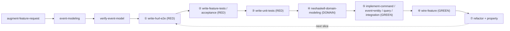

# Prompt: Build the NeoHaskell User-Skills Repository

> This is the rewritten, grounded version of the original request. It is meant to be handed to a
> fresh implementation agent. Exhaustive tables (full skill specs, the complete `event-model.json`
> schema, every template) live in [`BLUEPRINT.md`](./BLUEPRINT.md) — read it alongside this prompt.

## Mission

Build a set of **user-level** (not framework-maintainer) NeoHaskell skills in this repo at
`skills/<skill-name>/SKILL.md`. Consumers install them with `neo skills setup`, which copies each
folder into their project's `.claude/skills/<skill-name>/`. Together the skills form a **pipeline**
that lets an AI agent add a feature to a NeoHaskell project **incrementally**, honoring NeoHaskell's
philosophy of **immutable deployed code** and **constant-greenfield** development.

The skills are **flat and independent** (no orchestrator). Each must be self-contained and chainable
via an explicit **Inputs / Outputs / Next** header.

## Hard rules (read these first)

1. **PRIVACY — public repo.** This repo is published as `github.com/neohaskell/skills`. **Never** put
   information from private client projects into any skill, `BLUEPRINT.md`, or `prompt.md`. Use
   **only** public NeoHaskell repos for examples: the `neo` repo's `test-project` (`Counter`) and
   the `NeoHaskell` repo's `testbed` (`Cart`/`Stock`), or neutral invented toy domains. You may *read* private
   repos to learn patterns, but scrub every specific before it reaches a committed file.
2. **NeoHaskell ≠ Haskell.** `.hs` is a shared extension, and weak LLMs hallucinate vanilla Haskell.
   Every skill opens with that warning and a DO/DON'T table. Treat the trap table below as mandatory
   content.
3. **Assume a very weak LLM** as the reader. Every skill ships a complete copy-paste template, a
   DO/DON'T table, an Inputs/Outputs/Next header, and a "verify it compiled with `neo build`" step.
4. **There is no `todo`.** Stub unimplemented points with `panic "TODO: not implemented"` (loud
   fail-fast). Do not invent `todo`/`Debug.todo`.
5. **Immutability is real and must be encoded** (see "Immutability behavior" below): deployed
   `Commands/`/`Events/`/`Queries/` files are frozen; fixes become `V2`/`V3` siblings; entities only
   grow backward-compatibly.

## Decisions already made (do not re-litigate)

| Aspect | Decision |
| --- | --- |
| Architecture | flat, independent peer skills; no orchestrator |
| Auth API | newer `Service.AccessControl` / `AccessError` |
| Stub convention | `panic "TODO: not implemented"` |
| Outbound integrations | one handler type **per trigger** |
| Tests | full pyramid (Decider/Projection/Outbound/Acceptance/Property) + hurl e2e |
| `Core.hs` barrel | thin (re-export `Entity` + `Event` only) |
| Examples | public-only (Counter, Cart/Stock) |
| Model tiers | Opus 4.8 (planning/verify) · Sonnet (implement/test/CI) · Haiku (cheatsheet/tooling) — see BLUEPRINT §10 |
| Integrations | outbound-per-trigger **plus inbound** (`withInbound`/`Timer`) **and lifecycle outbound** (`withOutboundLifecycle`) |
| PR review | ship `neohaskell-code-review` (Opus) + `neohaskell-code-review-ci` (provider-agnostic, Sonnet) |
| Events naming | past-tense facts; CRUD smell is only `Update*`/`Delete*`/imperative echoes — **creation facts (`*Created`) are allowed** |
| Dev process | **outside-in TDD** (jwilger-style): RED → DOMAIN → GREEN → DOMAIN → REFACTOR per slice; tests written first, outside-in order, pyramid shape |
| Test suite | full Haskell pyramid assumes [neohaskell/neo#2](https://github.com/neohaskell/neo/issues/2) (nearly landed) — build as if it's in place |

## NeoHaskell facts every skill must encode

Use `import Core`; `Prelude` is OFF (`NoImplicitPrelude`). The mandatory trap table:

| Haskell reflex | NeoHaskell-correct |
| --- | --- |
| `String`/`[Char]` | `Text` |
| `[a]`, `map`/`filter`/`head`/`!!` | `Array a`; `Array.map`, `Array.takeIf`/`dropIf` (no `Array.filter`), `Array.get`→`Maybe` |
| `IO a` | `Task err a` (`IO` only at `main`) |
| `pure`/`return` | `Task.yield` (or `Result.Ok`) |
| `Either`/`Left`/`Right` | `Result error value`/`Err`/`Ok` (error is first param) |
| `f $ x` / `f . g` | `x \|> f` / `f .> g` |
| `<>` / `/=` / `()` / `error` | `++` (or `[fmt\|…#{x}…\|]`) / `!=` / `Unit`/`unit` / `panic :: Text -> a` |
| `let…in` / `where` / multi-equation heads | do-`let` / `case x of` |
| record field as function | dot access `rec.field` (`NoFieldSelectors`) |

Building blocks (full contracts in BLUEPRINT §2.4):

- **Entity** = record + `initialState` + `instance Default`/`Entity` + `type instance NameOf`/`EventOf` + `update` fold. Lives in `Entity.hs` (not locked).
- **Event** = one payload module per event in `Events/<Name>.hs` (type named `Event`), unioned by the `Event.hs` **ADT** + `getEventEntityId` + `type instance EntityOf`/`instance Event`. Payload files are **locked**; the ADT is not.
- **Command** = record + `getEntityId :: Cmd -> Maybe Uuid` + `decide :: Cmd -> Maybe E -> RequestContext -> Decision Ev` + `type instance EntityOf`/`TransportsOf '[WebTransport]`, closing with `command ''Cmd`. `decide` must end in `Decider.acceptNew`/`acceptExisting`/`reject`; generate ids with `Decider.generateUuid`. Secure by default.
- **Query** = record + `Json`/`ToSchema` + `canAccess`/`canView` (both **required** — `deriveQuery` won't compile without them; commands, by contrast, default to `authenticatedAccess`) + `deriveQuery ''Q [''E]` + a **hand-written** `instance QueryOf E Q` whose `combine` returns `Update q \| NoOp \| Delete`.
- **Integration** (per trigger) = nullary marker + `type instance EntityOf H = E` + pure `handleEvent :: E -> Ev -> Integration.Outbound`, closing with `outboundIntegration ''H`; wired by type via `Application.withOutbound @H`. IO lives in a separate `ToAction` instance.

Module layout per bounded context (BLUEPRINT §2.5): `Core.hs` (thin barrel) · `Entity.hs` ·
`Event.hs` (ADT) · `Events/<E>.hs` · `Commands/<C>.hs` · `Queries/<Q>.hs` · `Integrations/<H>.hs` ·
`Service.hs`.

`neo` CLI (BLUEPRINT §2.6): `neo new/build/run/test/lock/ide/inspect/skills`; build/run/test wrap
`cabal … all` inside `nix develop` (need Nix + flake). App serves on `:8080`
(`POST /commands/<kebab>`, `GET /queries/<kebab>`, `GET /openapi.json`, `GET /docs`, `GET /health`);
the IDE is `:2323`. No OpenAPI subcommand exists.

## The pipeline the skills implement

Design first, then each slice **outside-in, test-first** (RED → DOMAIN → GREEN → REFACTOR):

Existing **entities** are the starting model; events/commands/queries/integrations are treated as
not-yet-existing (greenfield) and added new. For a fix to deployed code, start at the relevant
implementer skill in **V2 mode** instead of `event-modeling`.

## `event-model.json` target

`event-modeling` appends a **feature = a `Submodel`** to `event-model.json`, compliant with the
public schema `https://neohaskell.org/schemas/event-model.v1.json` (in the `neo` repo at
`assets/ide/src/model/event-model.schema.json`). Additive append order: Submodel → Chapter(s)
(`submodelId`) → Slice(s) (`chapterId`) → nodes (command/event/query/integration with `sliceId`) →
edges → `layout`. Node/edge types, required-even-when-null keys, and referential-integrity rules are
fully tabulated in **BLUEPRINT §4**. `verify-event-model` adds best-practice checks: past-tense
events, **no CRUD-named events**, imperative commands, every event produced by a command, no orphans.
Vendor a copy of the schema under `event-modeling/references/` for offline validation.

## Immutability behavior to encode (hard-enforce + automate)

`.locked-files` (plain text) ∩ `git status` = a violation, caught by the `neo build` gate and a git
pre-commit hook. On a change to a deployed (locked) `Commands/`/`Events/`/`Queries/` file: **refuse
to edit it**, leave it byte-identical, and **scaffold a `V`+integer sibling** (`Foo.hs`→`FooV2.hs`,
type `Foo`→`FooV2`; reject `foo_v2`/`Foo.V2`/`FooVersion2`/lowercase `v`), then wire the V2 in. Never
advertise `--skip-lock-check`. Entities evolve **add-only** (record + `initialState` + `update` +
JSON default for old snapshots). Full rules in **BLUEPRINT §8**.

## Skills to create

The **25 skills** (5 language cheatsheets, 4 tooling, 13 pipeline, 1 process = `neohaskell-outside-in-tdd`, 2 review), with each one's
Inputs/Outputs/Next, model tier, and applied fixes, are specified in **[`SPEC.md`](./SPEC.md)** (the
Phase-0 decomposition); the summary inventory is in **BLUEPRINT §5**, the folder tree in
**BLUEPRINT §6**, and the build/review process + model-tier policy in **BLUEPRINT §10**. Frontmatter
rules (`name` + `description` required; folder name must equal `name`; `model:` tier) are in
**BLUEPRINT §7 / §10**.

## Definition of done

- All 21 skills exist at `skills/<name>/SKILL.md` with valid frontmatter (folder name == `name`).
- Each skill: warning + Inputs/Outputs/Next + complete copy-paste template + DO/DON'T table +
  `neo build` verification step.
- Every code example is public-only (Counter / Cart-Stock / toy) and contains **zero** client info.
- Templates compile against current NeoHaskell idioms (newer auth API, `panic` stubs, per-trigger
  integrations, per-module event layout, thin `Core.hs`).
- The `event-modeling` skill's output validates against the vendored v1 schema, and
  `verify-event-model` enforces the §4.6 best-practice checks.
- Immutability/V2 behavior is encoded in `neo-immutability-and-versioning` and referenced by every
  implementer skill.
