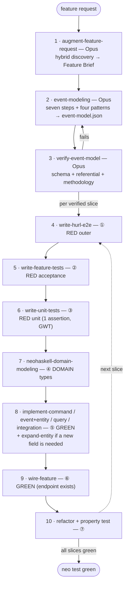

# NeoHaskell Feature Pipeline (start here)

This is **NeoHaskell, not vanilla Haskell** — the `.hs` extension is shared, but the prelude is `Core` and the framework is event-sourced / CQRS. This skill is the **entry point** that sequences the specialized skills. It writes no code and runs no `neo` commands itself; it decides *which skill runs next* and hands off to it.

## When to use

- "Add / build / implement / change / design a feature" in a NeoHaskell app.
- "Start a new NeoHaskell project" or "model this domain."
- "Fix a bug in `SomeCommand`/`SomeEvent`/`SomeQuery`" that is already deployed → the immutable-code V2 path (see Edge cases).

## Inputs / Outputs / Next

- **Input:** a feature request (vague or concrete), or a bug report against deployed code.
- **Output:** a fully implemented, wired, tested feature that is *all green* — `neo build` compiles (lock-gated) and `neo test` passes (Hspec specs under `tests/` **and** hurl e2e).
- **Next:** always start at `augment-feature-request` (step 1).

## How to drive it

Work **one step at a time**, and do not skip steps — the outside-in order (tests before implementation) is what keeps the tests honest and stops a weak model from writing code that "looks right" but isn't exercised.

In **Claude Code**, delegate each step to a sub-agent spawned with that step's model tier (read each skill's `metadata.model` — Opus / Sonnet / Haiku). In hosts without sub-agents (Cursor, Codex), just follow each skill inline; the tier is advisory.

### Phase A — Design (once per feature)

1. **`augment-feature-request`** (Opus) — turn the request into a concrete **Feature Brief**. On a brand-new project it first runs full-domain discovery and writes a domain overview; on an existing project it is feature-scoped.
2. **`event-modeling`** (Opus) — run the seven steps and the four patterns; append the feature (submodel → chapters → slices → command/event/query/integration nodes → edges) to `event-model.json`, additively.
3. **`verify-event-model`** (Opus) — gate the model: JSON-Schema shape, referential integrity, and Event Modeling best practices. If it fails, loop back to step 2. Output: a set of verified vertical slices.

### Phase B — Build each slice outside-in (RED → DOMAIN → GREEN → REFACTOR)

For **each** verified slice, in order:

4. **`write-hurl-e2e`** (Sonnet) — ① outer **RED**: the slice's observable HTTP behavior. Fails (404) until wired.
5. **`write-feature-tests`** (Sonnet) — ② acceptance **RED**: the in-domain flow (decide → update → combine). Fails to compile, then on the assertion.
6. **`write-unit-tests`** (Sonnet) — ③ inner **RED**: one assertion, given/when/then, for the building block (Decider / Projection / Outbound).
7. **`neohaskell-domain-modeling`** (Sonnet) — ④ **DOMAIN**: create the value objects and ADTs the red tests imply (make illegal states unrepresentable), with stubbed bodies so it compiles and fails on the assertion.
8. **`implement-command`** / **`implement-event-and-update-entity`** / **`implement-query`** / **`implement-integration`** (Sonnet) — ⑤ **GREEN**: the minimal code to pass. Use **`expand-entity`** first if the slice needs a new entity field.
9. **`wire-feature`** (Sonnet) — ⑥ **GREEN**: register the command / query / integration so the endpoint exists; the outer hurl test goes green.
10. **Refactor**; lock invariants with the property test (`write-feature-tests` ⑦). Move to the next slice.

The discipline itself (phase boundaries, one assertion per test, compiler-as-RED, outside-in *order* but pyramid *shape*) lives in **`neohaskell-outside-in-tdd`** — consult it whenever the loop feels unclear.

## Edge cases and branches

- **New project vs existing app** — `augment-feature-request` detects whether a domain overview exists and switches between full-domain discovery and feature-scoped.
- **Fixing a bug in DEPLOYED (locked) code** — you cannot edit a locked file under `Commands/`, `Events/`, or `Queries/`. Skip event-modeling; start at the relevant implementer skill in **V2 mode** (see **`neo-immutability-and-versioning`**): scaffold a `FooV2` sibling, drive it with a fresh outside-in TDD cycle, and wire it. Never edit the locked original.
- **A new event needs a field the entity lacks** — run **`expand-entity`** first. Entities are **add-only** (never removed/renamed/retyped, never V2'd).
- **Inbound / timer / webhook trigger (the Translation pattern)** — model it as an inbound integration; `implement-integration` has the `withInbound` / `Integration.Timer` branch.
- **An integration is not built yet** — stub the outbound handler with `Integration.none` and a `-- TODO:` comment. Never `panic` a pure `handleEvent` — it crashes the dispatcher when that event fires.
- **Where tests live** — all tests go under `tests/` (Hspec specs *and* `.hurl` files); `neo test` compiles and runs both. Do not use a `test/` directory.

## Reference and tooling skills (pull in as needed)

- **Language:** `neohaskell-core-prelude`, `neohaskell-collections`, `neohaskell-effects-and-errors`, `neohaskell-records-and-json`, `neohaskell-module-layout`.
- **Tooling:** `neo-cli`, `neo-immutability-and-versioning`, `neo-config-and-secrets`, `neo-run-and-inspect`.
- **PR review** (separate from building a feature): `neohaskell-code-review` + `neohaskell-code-review-ci`.

## Done when

Every slice is green: `neo build` compiles (lock-gated), `neo test` passes (Hspec under `tests/` + hurl e2e), and the feature is reachable over HTTP.
